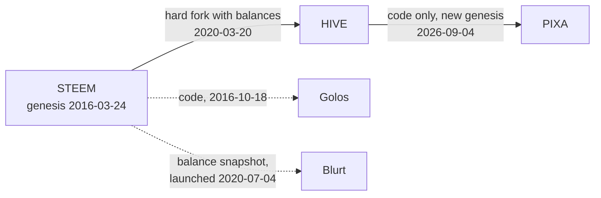

# From STEEM to HIVE to PIXA

> **Status: Historical**, with today's figures checked on 2026-10-05. Every dated fact links to its source, and on-chain facts can be re-read from each chain's public API.

Pixa runs on code that has been in public, adversarial use since 2016. This page traces that lineage: Steem, the first chain where posting and voting are themselves transactions; Hive, the community fork of 2020; and Pixa, a new chain started in 2026 from Hive's code. It also says what Pixa took from them and what it did not.

## Steem, 2016–2020

Steem's first block was produced on 2016-03-24. It was built by Steemit, Inc., founded by Ned Scott and Dan Larimer. Its novelty was simple to state:

- **Social actions are transactions.** A post, a comment and a vote are each an operation on the chain.
- **Votes direct rewards.** Stake-weighted votes decide who receives each day's new tokens.
- **No transaction fees.** Steem used a bandwidth allowance instead.

The 2017 Bluepaper named the combination of a reward pool and stake-weighted voting *Proof-of-Brain*.

STEEM briefly ranked third among cryptocurrencies by market value in July and August 2016. Two changes came in the years that followed:

- **Larimer left** Steemit, Inc. in March 2017.
- **Resource Credits arrived** with hardfork 20 on 2018-09-25. They are the fee-less model Pixa still uses.

In between, STEEM's market value peaked at about US$1.98 billion on 2018-01-03, when it ranked in the high thirties.

## The 2020 split

| Date (UTC) | Event |
|---|---|
| 2020-02-14 | Steemit, Inc. announces a "strategic partnership" with the TRON Foundation, widely reported as its acquisition by Justin Sun. ([Business Wire](https://www.businesswire.com/news/home/20200214005129/en/Steemit-Joining-TRON-Ecosystem), [CoinDesk](https://www.coindesk.com/tech/2020/03/02/why-crypto-should-care-about-justin-suns-steem-drama)) |
| 2020-02-23 | A majority of Steem witnesses adopt soft fork 0.22.2, which blocks certain operations from Steemit-owned accounts. ([CoinDesk](https://www.coindesk.com/tech/2020/02/24/justin-sun-bought-steemit-steem-moved-to-limit-his-power)) |
| 2020-03-02 | The exchanges Binance, Huobi and Poloniex vote with customer-held stake to install a new set of witnesses, which reverses the soft fork. ([CoinDesk](https://www.coindesk.com/tech/2020/03/02/why-crypto-should-care-about-justin-suns-steem-drama), [The Block](https://www.theblock.co/post/57508/tron-steem-takeover-crypto-exchanges-governance-reversal-soft-fork-blockchain)) |
| 2020-03-20 14:00 | Hive launches as a hard fork of Steem at block 41,818,752. Balances are mirrored, except those of 328 accounts tied to Steemit's stake or to the witness takeover, which go to Hive's treasury. ([Hive launch post](https://hive.blog/communityfork/@hiveio/announcing-the-launch-of-hive-blockchain), on-chain block 41,818,752) |

Hive later added two governance rules. From hardfork 24 (2020), newly staked tokens wait 30 days before they count in governance votes; Hive's whitepaper presents this as a defence against a repeat of the takeover. From hardfork 25 (2021), governance votes expire after a year without use. Pixa has applied both rules since genesis ([Decentralization and Safeguards](../07-governance/decentralization-and-safeguards.md)).

Steem itself continued, and still produces blocks in 2026.

## Hive, 2020 onward

| Hardfork | Activated (UTC) | What it changed |
|---|---|---|
| 24 | 2020-10-14 | A new chain ID; a 30-day wait before new stake counts in governance |
| 25 | 2021-06-30 | Reverse auction removed and curation windows changed; HBD interest paid on savings only; recurrent transfers; governance votes expire after a year |
| 26 | 2022-10-11 | Resource Credit delegation; one-block irreversibility; new HBD debt limits |
| 27 | 2022-10-24 | Fix to witness scheduling |
| 28 | 2025-11-19 | Transaction expiry up to 24 hours; a vote's cost based on the full mana bar; revised authority rules: only the exact authority required is accepted, and redundant signatures are allowed |

Hive is still active in 2026: it produces blocks and trades on major exchanges. Its whitepaper is dated 2020-09-28. Pixa is built on hived 1.28.7, the Hive release that carries hardfork 28.

## Other branches

- **Golos** launched on 2016-10-18 as a separate chain built from Steem's code, for Russian-speaking users ([ForkLog](https://forklog.com/sostoyalsya-zapusk-russkoyazychnoj-sotsialno-medijnoj-platformy-golos/)). Part of its team moved to the CyberWay platform in 2019. The original chain kept running and still produces blocks in 2026.
- **Blurt** launched on 2020-07-04 from a snapshot of Steem balances, with no downvotes, no stable token, and transaction fees set by witnesses ([Blurt README](https://gitlab.com/blurt/blurt)). It still produces blocks in 2026.

## Pixa, 2026

| Date (UTC) | Event |
|---|---|
| 2026-09-04 12:00 | Genesis. The chain starts from block 0 with no balances copied from Steem or Hive. Hive's hardforks 1–28 are applied together at block 1. |
| 2026-09-16 | The witnesses upgrade to 1.29.0 and vote for hardfork 29. |
| 2026-09-18 12:00 | Hardfork 29 activates at block 402,205. It resets the reward fund's denominator and scales the hardfork quorum to the number of witnesses. |
| 2026-10-06 | The witnesses upgrade to 1.30.0 and vote for hardfork 30. |
| 2026-10-07 12:00 | Hardfork 30 activates at block 949,330: small votes count, witness pay and the fund's share are paid exactly, custom operations are priced by size, owner-key history is recorded ([Protocol Upgrades](../07-governance/protocol-upgrades.md#hardfork-30)). |

**Pixa is a fork of the code, not of the chain.** Hive and Blurt each began from Steem's account balances. Pixa began from Hive's software and a new genesis:

- no airdrop
- no mining
- 100 million PIXA created as stake in two allocation accounts
- a seeded community fund

The details are on [System Accounts](../21-reference/system-accounts.md#genesis-allocation).

Dan Larimer's 2016 post "[Steemit's Evil Plan for Cryptocurrency World Domination](https://steemit.com/steem/@dan/steemit-s-evil-plan-for-cryptocurrency-world-domination)" set out three phases: a stable currency, a marketplace, then sidechains and smart contracts. Pixagram's 2025 essay argues that it completes that plan. [The Plan Revisited](../20-history-and-design/the-plan-revisited.md) sets the plan beside the record and checks the essay; this page keeps to the record.

## What Pixa kept, changed and dropped

| | Steem (2016) | Hive (2020) | Pixa (2026) |
|---|---|---|---|
| Origin | New chain | Hard fork of Steem, balances mirrored | New chain from Hive's code |
| Consensus | DPoS, 21 witness slots | same | same; 8 witnesses on 2026-10-08 |
| Block time | 3 s | 3 s | 3 s |
| Fees | Bandwidth, then Resource Credits (2018) | Resource Credits | Resource Credits; a few operations carry fees ([list](../21-reference/chain-parameters.md#figures-you-may-meet-elsewhere)) |
| Second token | SBD, aimed at US$1 | HBD, aimed at US$1 | PXS: no peg; its feed references one Big Mac |
| Interest | SBD interest set by witnesses | HBD interest on savings | none |
| Reward for holding stake | yes | yes (15% of issuance) | none |
| Curation share | 25% at launch, 50% from 2019 | 50% | 40% |
| Artworks | Links in posts | Links in posts | Stored inside the post |
| Reward curves | n² at launch, linear from 2017, convergent from 2019 | convergent until 2021, then linear | the convergent curves of 2019 |
| Marketplace | Proposed in 2016; never built into the protocol | Second-layer apps | Planned for 2027 |

Every Pixa value in this table, with its source, is on [Chain Parameters](../21-reference/chain-parameters.md).

## Sources

- **Steem**
  - Genesis: on-chain block 1 ([SteemWorld](https://steemworld.org/block/1)); [Steem whitepaper, March 2016 edition](https://web.archive.org/web/20160815131730/https://steem.io/SteemWhitePaper.pdf), which weighs payouts by n²; [Steem Bluepaper](https://steem.com/steem-bluepaper.pdf) (origin of the term Proof-of-Brain).
  - Reward curves: Hive's code sets linear curves at hardfork 19 and convergent curves at hardfork 21 ([database_hardfork.cpp](https://github.com/openhive-network/hive/blob/1.28.7/libraries/chain/database_hardfork.cpp)).
  - Rankings: [CoinMarketCap snapshot of 2016-07-17](https://coinmarketcap.com/historical/20160717/); [CoinMarketCap STEEM historical data](https://coinmarketcap.com/currencies/steem/historical-data/).
  - Hardfork 20: [Steemit blog](https://steemit.com/steem/@steemitblog/hf20-update-hardfork-successful).
  - Larimer's departure: [Steemit joint statement](https://steemit.com/steemit/@steemitblog/joint-statement).
- **Hive**
  - [Launch post](https://hive.blog/communityfork/@hiveio/announcing-the-launch-of-hive-blockchain) and [whitepaper](https://hive.io/whitepaper.pdf).
  - Hardforks 24–27: announcements on [hive.blog/@hiveio](https://hive.blog/@hiveio).
  - Hardfork 28: [release 1.28.0](https://gitlab.syncad.com/hive/hive/-/releases/1.28.0).
  - Activation dates: the `hardfork_operation` virtual operation in each activation block, read with `account_history_api.enum_virtual_ops` on a Hive API node. (`get_hardfork_properties` returns each release's planned time, not its activation.)
- **Blurt:** [README](https://gitlab.com/blurt/blurt), which gives the snapshot block, 43,526,969, and [FAQ](https://blurtwallet.com/faq.html).
- **Golos:** [launch report](https://forklog.com/sostoyalsya-zapusk-russkoyazychnoj-sotsialno-medijnoj-platformy-golos/) and [explorer](https://explorer.golos.id/).
- **Pixa:** genesis time and hardforks in [Chain Parameters](../21-reference/chain-parameters.md#network-identity); `condenser_api.get_ops_in_block` for blocks 1 and 402,205.
