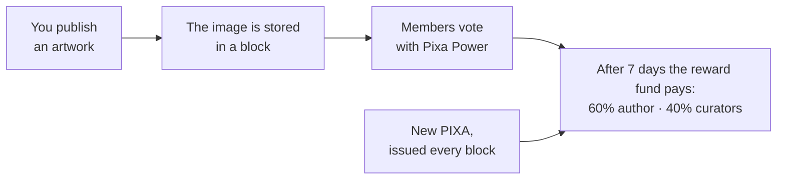

# What Is Pixagram

> **Status: Live.** Mainnet has run since 2026-09-04. Buying and selling artworks on chain is planned for 2027. Checked against the app at commit `ca1d157` and the chain on 2026-10-05.

Pixagram is a social network for pixel art that runs on its own public blockchain, the Pixa chain. This page explains what you can do there today, what makes it different, and what is not built yet.

## In one paragraph

You publish pixel art; the image is written into the chain inside your post. Other members vote on what they value. Their votes carry weight in proportion to their stake, called Pixa Power. Seven days after you publish, the chain pays the post's rewards out of new issuance: 60% to you and 40% to the members who voted for it, most of it to those who voted early. Nobody pays a fee to post or vote. Instead, every account has Resource Credits that recharge from its stake. The rules are enforced by elected block producers, the *witnesses*, not by a company.

## What you can do today

**Create and share**

- **Publish an artwork.** You can upload a picture, or describe one in words. Pictures that are already pixel art are published as they are. Others are converted in your browser, or, if you choose, by an AI model. The result is a lossless WebP image stored inside your post. See [Pixel Art On Chain](../03-art-on-chain/pixel-art-on-chain.md).
- **Write blog posts** in a community, with images and a cover.
- **Comment, follow and join communities**, or start a community of your own. See [Communities](../02-social-layer/communities.md).

**Curate and earn**

- **Vote on posts and comments.** Votes decide where each day's rewards go, and voters share 40% of a post's rewards, most of it going to early voters. See [Proof-of-Brain](../02-social-layer/proof-of-brain.md) and [Voting and Curation](../02-social-layer/voting-and-curation.md).
- **Collect rewards.** Author rewards arrive as Pixa Power and PXS; curation rewards arrive as Pixa Power. You claim them in the wallet. See [Posting and Rewards](../02-social-layer/posting-and-rewards.md).

**Manage your tokens.** The wallet can:

- send PIXA or PXS, including recurring transfers
- stake (power up) and unstake (power down)
- lend stake to another account (delegate)
- convert between PIXA and PXS
- use savings
- produce tax reports for 26 jurisdictions

See [Tokens at a Glance](../04-tokens-and-economy/tokens-at-a-glance.md).

**Take part in governance**

- **Vote for witnesses**, the block producers.
- **Vote on proposals** to the Decentralized Pixa Fund, or submit your own. See [Witnesses and DPoS](../07-governance/witnesses-and-dpos.md) and [Decentralized Pixa Fund](../07-governance/decentralized-pixa-fund.md).

The app is available in 27 languages.

## How an account starts

You open an account in the app after verifying a phone number. Your keys are created in your browser:

1. The app generates an 18-word recovery phrase (BIP-39).
2. It derives the account's keys from that phrase.
3. It sends only the *public* keys to the account service.

The operator pays the account creation fee and lends the new account a small amount of Pixa Power, so it has Resource Credits from the first day. A proposal to the [Decentralized Pixa Fund](../07-governance/decentralized-pixa-fund.md) currently funds this. The app then offers a PDF backup of your phrase and keys. Keep it offline. Step by step: [Create an Account](../08-guides/create-an-account.md).

The loaned stake is enough to publish several artworks a day, and since hardfork 30 it is enough for your votes to count: a full vote moves rewards from 2.5 Pixa Power, though a new account's vote alone is far too small to lift a post over the minimum payout ([why](../02-social-layer/voting-and-curation.md#from-vote-to-rshares)).

## What makes it different

- **The artwork is the record.** Most "on-chain art" stores a link or a hash, while the image lives elsewhere. On Pixagram, the post body is the image. Every node that keeps the chain's full history keeps every artwork ([Permanence and Provenance](../03-art-on-chain/permanence-and-provenance.md)).
- **Rewards pay for work, never for holding.** Holding PIXA, Pixa Power or PXS earns nothing by itself. Stake earns only through curation, and new issuance goes to authors, curators, witnesses and the community fund ([Supply, Inflation and Yield](../04-tokens-and-economy/supply-inflation-and-yield.md)).
- **Its own chain, on proven code.** Pixa runs on the code of Hive, a fork of Steem. That code has been in public use since 2016. Pixa started from a new genesis and tuned the rules for pixel art and a young network ([From STEEM to HIVE to PIXA](from-steem-to-hive-to-pixa.md)).

## What is not here yet

- **Buying and selling artworks** on chain is planned for 2027 ([NFTs and Marketplace](../17-marketplace/nfts-and-marketplace.md)). The app's NFT tab is a preview.
- **Payout choices.** You cannot yet decline rewards or take them entirely as Pixa Power. Every post uses the default split. The chain supports both options; the app does not set them yet.
- **Tipping** is not a separate feature; you can send a transfer from the other person's wallet page.
- **Market price.** PIXA does not trade on any market yet. Fiat values shown in the app use a fixed placeholder price.

## Who runs it

- **The chain:** witnesses elected by stakeholders.
- **The community fund:** stakeholders, through proposal votes.
- **The software:** three legal entities share the work of developing it, stewarding the protocol and operating the app ([Who Does What](who-does-what.md)). None of them can change the chain's rules alone.

## Inherited → changed

| | Steem / Hive | Pixa |
|---|---|---|
| Content | Mostly text; images are links | Artworks are stored inside the post |
| Rewards for holding stake | A share of issuance | None |
| Curation share | 50% | 40% |
| Accounts | Created by existing accounts for a fee or a ticket | Same; the app opens yours after phone verification |

## Sources

- App, commit [`ca1d157`](https://github.com/pixagram-blockchain/pixagram-ui-dev/tree/ca1d15762b52ec08f33c69ca9afa34bb78c0df52):
  - publishing: [`NewPost.js`](https://github.com/pixagram-blockchain/pixagram-ui-dev/blob/ca1d15762b52ec08f33c69ca9afa34bb78c0df52/src/js/components/NewPost.js)
  - wallet: [`PixaWalletDialog.js`](https://github.com/pixagram-blockchain/pixagram-ui-dev/blob/ca1d15762b52ec08f33c69ca9afa34bb78c0df52/src/js/components/PixaWalletDialog.js)
  - sign-up: [`CreateAccountDialog.js`](https://github.com/pixagram-blockchain/pixagram-ui-dev/blob/ca1d15762b52ec08f33c69ca9afa34bb78c0df52/src/js/components/CreateAccountDialog.js)
- Chain values: [Chain Parameters](../21-reference/chain-parameters.md).
- Proposal funding account creation: `database_api.list_proposals`, proposal 1, read on 2026-10-05.
