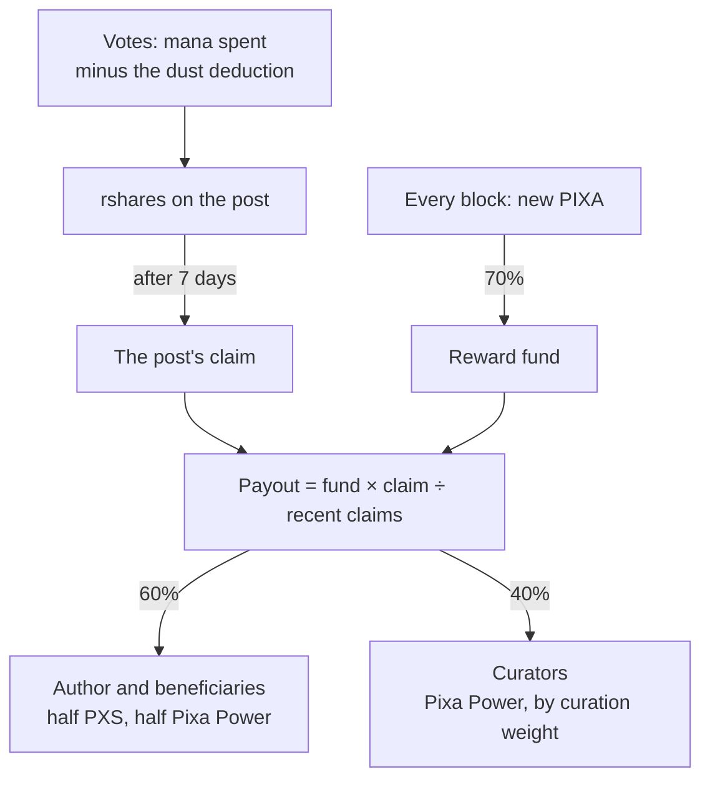

# Proof-of-Brain

> **Status: Live.** Rewards have been paid since hardfork 29 (2026-09-18); hardfork 30 (2026-10-07) let votes from small accounts count. Figures from the live chain were read at block 895,415 on 2026-10-05 and block 977,074 on 2026-10-08.

A blockchain can check a signature or a hash, but it cannot judge a drawing. Proof-of-Brain solves this by handing the judgement to people. Each day a fixed amount of new PIXA is issued. Members holding stake vote on what they value, and the chain divides that amount in proportion to their votes. This page explains the idea, how the Pixa chain carries it out, and where it falls short today.

## The idea

The Steem whitepaper calls this *subjective proof of work*. Mining rewards whoever burns the most electricity, and that work has no use beyond securing the chain. Proof-of-Brain rewards work a community actually wants. It works in four steps:

1. **Fix the amount first.** The chain commits to distributing a set amount whatever happens. The question becomes "whom should we pay?", not "should we pay?".
2. **Let the people with the most to lose decide.** Votes are weighted by stake. Holders of stake gain most when the network attracts good work, and lose most when rewards are wasted.
3. **Limit how often anyone can vote.** Each vote spends voting mana, which recharges slowly. Splitting stake across many accounts does not create more influence, and automated mass voting gains nothing.
4. **Let the crowd check the few.** Downvotes let other holders cancel rewards they judge undeserved.

The 2017 Steem Bluepaper gave the combination of a reward pool and stake-weighted voting its name: Proof-of-Brain.

## How the Pixa chain does it



1. **Funding.** Each block adds 70% of new issuance to a single reward fund ([Issuance](../21-reference/chain-parameters.md#issuance)). On 2026-10-05 that came to about 18,800 PIXA a day (`condenser_api.get_dynamic_global_properties`).
2. **Voting.** A full-strength vote spends 2% of the voter's full mana bar. The mana spent, minus a fixed dust deduction, becomes the vote's *rshares*: its weight in the reward calculation ([Voting and Curation](voting-and-curation.md)).
3. **Cash-out.** Seven days after publication, the post's net rshares become its *claim*. The claim is added to a running total of recent claims, and the post receives that share of the fund:

   ```
   payout = reward fund balance × claim ÷ recent claims
   ```

   Recent claims decay over 15 days, so a post competes with everything paid out in about the previous two weeks.
4. **Division.** The author receives 60%, minus any beneficiaries named in the post. Curators share 40%, weighted toward those who voted early ([Posting and Rewards](posting-and-rewards.md)).

### The shape of the curves

The chain does not pay rshares directly. It first passes them through two curves:

- **Authors: `convergent_linear`.** With Pixa's content constant of 2,500, this is linear for any vote large enough to count. Twice the votes means twice the reward.
- **Curators: `convergent_square_root`.** A curator's weight is the growth in the square root of the post's total rshares that their vote caused. The first vote on a post therefore earns more than a later vote of the same size. On a post with two equal votes, the second earns between about a third and a half of what the first earns. The range comes from the chain's fast approximation of the square root. The intent is to reward discovery rather than piling on.

## What Pixa changed

- **Holding stake earns nothing.** Hive pays stakers 15% of issuance, and pays interest on HBD held in savings. Pixa pays neither ([Supply, Inflation and Yield](../04-tokens-and-economy/supply-inflation-and-yield.md)). Curation rewards pay for the work of voting.
- **Curators receive 40%** of a post's rewards, where Hive pays 50%. More of each reward goes to the person who made the work.
- **The 2019 curves are kept.** Hive switched both curves to linear in 2021. Pixa keeps the convergent curves Steem adopted in 2019, which favour early curation.
- **The inherited denominator was reset.** At genesis, Pixa applied Hive's hardfork 21 value for the total of recent claims, a 2019 Steem figure about 18,000 times the scale that hardfork 29 later set. Every early payout fell below the 0.020 PXS minimum and was paid as nothing. Hardfork 29 lowered the total to this chain's scale ([Chain Parameters](../21-reference/chain-parameters.md#voting-and-curation)).

## Where it falls short today

- **Small votes counted for nothing until hardfork 30.** Every vote loses a fixed dust deduction inherited from Hive, and on Pixa one VESTS stands for about 1,600 times more stake than on Hive, so until 2026-10-07 a vote moved rewards only from 2,500 effective Pixa Power, and 21 of the chain's 83 accounts could take part. Hardfork 30 divided the deduction by 1,000: a full vote now counts from 2.5 Pixa Power, and 75 of 100 accounts clear it on 2026-10-08 ([details](voting-and-curation.md#from-vote-to-rshares)). A post still pays nothing under 0.020 PXS, so the smallest accounts move rewards only together.
- **Few voters, so few judges.** Because most stake sits in a handful of accounts, rewards reflect the judgement of very few people ([Decentralization and Safeguards](../07-governance/decentralization-and-safeguards.md)).
- **Self-voting is allowed.** The chain does not stop anyone voting for their own posts. Downvotes and social pressure are the only checks.

None of this is hidden. Each limit follows from rules listed on [Chain Parameters](../21-reference/chain-parameters.md), and changing any of them takes a hardfork.

## Inherited → changed

| | Steem / Hive | Pixa |
|---|---|---|
| Share of issuance to the reward fund | 65% | 70% |
| Curation share of a post's rewards | 50% | 40% |
| Curves | linear since Hive's HF25 | convergent linear and convergent square root |
| Reward for holding stake | 15% of issuance | none |
| Recent-claims scale | sized for a busy chain | reset to this chain's scale by HF29 |
| Smallest full vote that counts | about 1.6 HP on Hive | more than 2.5 Pixa Power since HF30; 2,500 before |

## Sources

- [Steem whitepaper](https://steem.com/steem-whitepaper.pdf): "Subjective Contributions", "Distributing Currency", "Voting on Distribution of Currency", "Rate Limited Voting".
- [Steem Bluepaper](https://steem.com/steem-bluepaper.pdf), for the term Proof-of-Brain.
- [Hive whitepaper](https://hive.io/whitepaper.pdf), §V.4–V.6.
- **Code**:
  - The curves: [reward.cpp:60-71](https://github.com/pixagram-blockchain/pixagram/blob/48f75a28840c24e5a5b42ccb4f94dc8668ecb443/libraries/chain/util/reward.cpp#L60-L71).
  - The payout: [reward.cpp:17-29](https://github.com/pixagram-blockchain/pixagram/blob/48f75a28840c24e5a5b42ccb4f94dc8668ecb443/libraries/chain/util/reward.cpp#L17-L29).
  - The 60/40 split: [database_comment.cpp:222-236](https://github.com/pixagram-blockchain/pixagram/blob/48f75a28840c24e5a5b42ccb4f94dc8668ecb443/libraries/chain/database_comment.cpp#L222-L236); the claims decay: [database_comment.cpp:400-410](https://github.com/pixagram-blockchain/pixagram/blob/48f75a28840c24e5a5b42ccb4f94dc8668ecb443/libraries/chain/database_comment.cpp#L400-L410).
- **Live chain**: `condenser_api.get_reward_fund ["post"]`.
