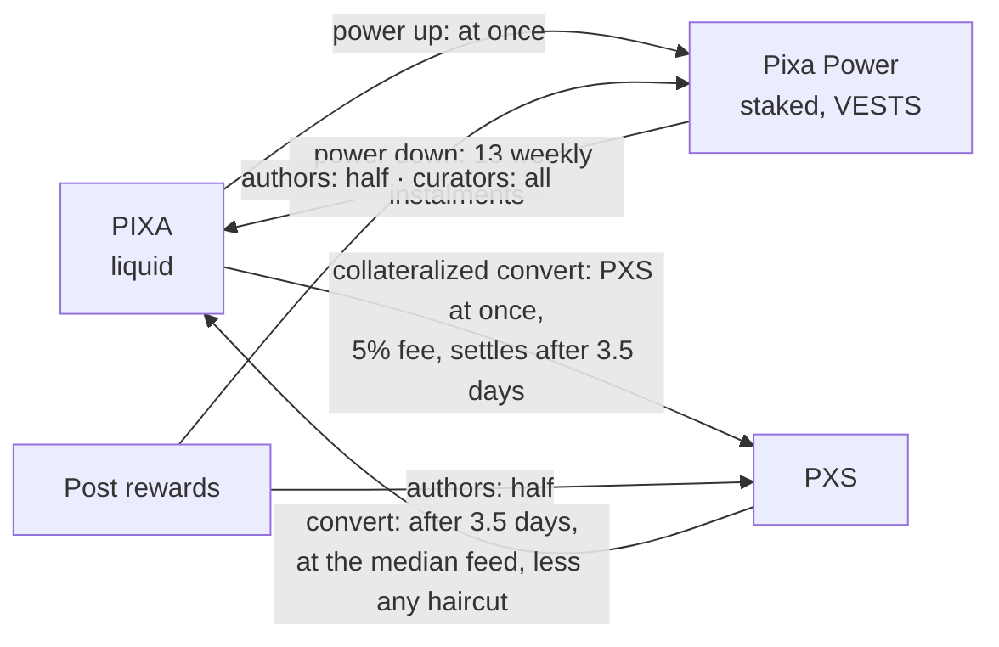

# Tokens at a Glance

> **Status: Live.** Supply figures were read at block 893,370 on 2026-10-05.

The Pixa chain has one token, PIXA, in two forms, liquid and staked, and a second unit, PXS. This page says what each one is for, how you get it, and how it changes form.

## The three units

| Unit | What it is | What it is for | How you get it |
|---|---|---|---|
| **PIXA** | The liquid token, with 3 decimals | Transfers; staking; converting to PXS; paying the account creation fee | Rewards paid when PXS printing is off; powering down; converting PXS; transfers |
| **Pixa Power (PXP)** | PIXA staked, held on chain as VESTS | Voting weight; Resource Credits; governance votes after 30 days; curation rewards | Powering up PIXA; author and curation rewards; delegation (borrowed, not owned) |
| **PXS** (Pixa Supra) | A second unit that promises no price, with 3 decimals | Part of author rewards; the currency the DPF pays in; the proposal fee; transfers; converting to PIXA | Author rewards; converting PIXA; transfers |

**What PXS is not.** PXS promises no price. It has no peg, cannot be redeemed for money and pays no interest, and no one stands behind its value. In one phrase, it is a Big Mac referenced supracoin. It converts into PIXA at the median of the witnesses' feeds, which reference one Big Mac, less a haircut if the network is stretched ([rules](../21-reference/chain-parameters.md#pixa-supra-pxs-and-the-price-feed)). Its design, and how it runs today, start at [PXS at a Glance](../05-pixa-supra/pxs-at-a-glance.md).

**Nothing pays you for holding.** Holding PIXA, Pixa Power or PXS earns no interest and no share of issuance. Stake earns only by curating ([Supply, Inflation and Yield](supply-inflation-and-yield.md)).

## How they change form

| From → to | Operation | Time | Cost |
|---|---|---|---|
| PIXA → Pixa Power | power up (`transfer_to_vesting`) | Immediate; counts in governance after 30 days | none |
| Pixa Power → PIXA | power down (`withdraw_vesting`) | 13 weekly instalments, the first after 7 days | none |
| PXS → PIXA | `convert` | 3.5 days, at the median feed in force then | none; the haircut may reduce it |
| PIXA → PXS | `collateralized_convert` | PXS at once; settles after 3.5 days | 5% fee; twice the value locked as collateral; refused if PXS would grow past its limit |
| PIXA or PXS | savings | Withdrawals take 3 days | none; no interest |

All of these values, with their sources, are on [Chain Parameters](../21-reference/chain-parameters.md).

## Names and symbols

- **PIXA** is the symbol on chain. PXA is the ticker the price-feed software expects for PIXA market pairs. PIXA does not trade on any market yet.
- **Pixa Power** appears on chain and in the API as **VESTS**, with 6 decimals. On Pixa, 1 VESTS has stayed worth about 1 PIXA since genesis.
- **PXS** is the counterpart of Hive's HBD and Steem's SBD; the [Glossary](../21-reference/glossary.md#other-names-you-may-meet) maps the older names.

## Supply on 2026-10-05

| | Amount | Note |
|---|---|---|
| PIXA, all forms | 100,653,153.940 | Includes the staked PIXA behind Pixa Power and the reward fund |
| of which staked as Pixa Power | 94,027,118.757 | 94,027,118.081697 VESTS |
| PXS | 251,607.867 | 249,310.119 of it held by the DPF treasury |

Read the current figures with `condenser_api.get_dynamic_global_properties` (fields `current_supply`, `total_vesting_fund_pixa` and `current_pxs_supply`).

## Inherited → changed

| | Steem / Hive | Pixa |
|---|---|---|
| Liquid token | STEEM / HIVE | PIXA |
| Staked form | Steem Power / Hive Power | Pixa Power |
| Second unit | SBD / HBD, aimed at US$1 | PXS: no peg; its feed references one Big Mac |
| Interest on the second unit | Yes (Hive: savings only) | None |
| Reward for holding stake | 15% of issuance | None |
| VESTS per liquid token | about 1,608 on Hive, falling | about 1, flat |

## Sources

- [Chain Parameters](../21-reference/chain-parameters.md), every value and its code reference.
- [Hive whitepaper](https://hive.io/whitepaper.pdf), §II.1–II.3.
- Live chain: `condenser_api.get_dynamic_global_properties` at block 893,370.
