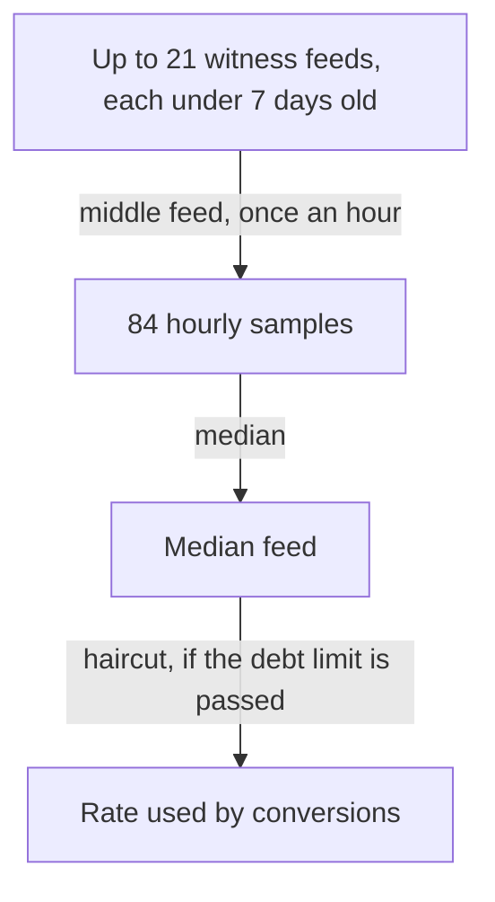

# Oracle and Price Feed

> **Status: Live.** PXS promises no price. Nine witnesses publish its feed, and every one of them publishes the same placeholder, 51.833 PIXA per PXS: PIXA does not trade on any market yet. Read at block 917,250 on 2026-10-06.

PXS promises no price. What the chain has instead is a reference: the witnesses' statement of how many PIXA one Big Mac costs. The PXS design notes call this sensing part the Oracle ([Glossary](../11-reference/glossary.md#oracle)). This page explains what a feed states, how the chain reduces many feeds to one median, how fast that median can move, what it has read since genesis, and what it cannot do.

## What a feed states

A feed is a price that a witness publishes with the `feed_publish` operation: one PXS against a number of PIXA.

```text
PIXA per PXS = price of one Big Mac ÷ price of one PIXA, in the same currency
```

On 2026-10-06 every witness published 6.22 USD ÷ 0.12 USD = 51.833. The 6.22 USD is the US price in The Economist's Big Mac index, July 2026 edition. The 0.12 USD is the placeholder for PIXA ([below](#the-placeholder)).

In hived the field is Hive's `hbd_exchange_rate`. The public API shows it as `pxs_exchange_rate` ([field renames](../09-developers/differences-from-hive.md#field-renames)).

## From the witnesses' feeds to the median

Once an hour, every 1,200 blocks, the chain does the following ([database.cpp:2418-2533][db-2418]). The numbers are on [Chain Parameters](../11-reference/chain-parameters.md#pixa-supra-pxs-and-the-price-feed).

1. **Collect.** It reads the feed of each scheduled witness and skips any feed older than 7 days ([2425-2443][db-2425]).
2. **Count.** It needs a quorum of the scheduled witnesses to have a current feed. With fewer, it takes no sample that hour, and the median in force stays as it was ([2445][db-2445]).
3. **Take the middle feed.** It sorts the feeds and keeps the middle one; with an even number, whichever of the two middle feeds names fewer PIXA per PXS. This is the hour's sample ([2447-2448][db-2447]).
4. **Keep 84 samples.** It adds the sample to the last 84, about 3.5 days, and drops the oldest ([2459-2465][db-2459]).
5. **Take the median of the samples.** The median of the 84 samples is the *median feed* that conversions use. The chain also records the lowest and the highest sample ([2469-2474][db-2469]).
6. **Check the debt limit.** If the PXS outside the treasury is too large against all PIXA, the chain corrects the median: the haircut ([Haircut, Corridor and Settlement](haircut-corridor-and-settlement.md#the-haircut)).



The design notes call the two medians *variety attenuators*: the first, across witnesses, rejects a wrong reporter; the second, across time, rejects a short spike ([Variety and Regulation](../06-economic-cybernetics/variety-and-regulation.md#attenuators)).

## How fast it can move

- **One witness can move it only a little.** With 9 fresh feeds, the hour's sample is the fifth from either end. One witness can shift it at most to the next feed above or below, and not at all while the others agree, as they do today. To move it further, at least 5 of the 9 must move.
- **Fewer fresh feeds, fewer deciders.** If only 3 witnesses have published in the last 7 days, the sample is the middle of those 3, and any 2 of them decide it.
- **About 42 hours of delay.** The median changes only once about half of its 84 samples have changed. A change that every witness makes at once reaches conversions after about 42 hours, and a change that lasts less than that never reaches them.
- **The agnostic feed adds a brake.** By default, each publish keeps a witness's new feed within 50% of the feed it has on chain, so a large move takes several hours to pass through even one witness ([chain.go:371-386][agn-371]).

These delays protect conversions from a false or sudden reading. They also mean that a real fall in PIXA's value reaches the median late: for up to about two days after it, conversions still use the older value.

## The placeholder

PIXA does not trade on any market. A feed needs a price for PIXA, so every witness divides by 0.12 USD, a placeholder the witnesses agreed on.

- **On 2026-10-06, all 84 samples were 51.833.** The median, the lowest and the highest sample were equal (`condenser_api.get_feed_history`).
- **The Oracle carries no market information today.** The collateral ratio, the print rate and the haircut are computed from the placeholder, not from what PIXA would fetch.
- **Two feed programs exist.** `bigmac-feed` v1.0.3, which the witnesses run today, always divides by the placeholder. The agnostic feed reads a market price for PIXA and uses a placeholder only when its operator sets one. Without a market and without that setting, it publishes nothing, and the chain keeps the witness's previous feed for up to 7 days ([the agnostic feed](#the-agnostic-feed)).

## What it has read since genesis

The median has had three values. Each change came from software, not from a market:

| From (UTC) | Feed | Where it came from |
|---|---|---|
| 2026-09-04 12:00 | 102.000 | Set at genesis by the chain's code, so that PXS amounts had a PIXA value before any witness published ([database_init.cpp:433-441][init-433]). The first witnesses published the same value. |
| 2026-09-04 17:39 | 51.000 | 6.12 USD ÷ 0.12 USD: the January 2026 edition of the index, through `bigmac-feed` v1.0.2 |
| 2026-09-07 12:37 | 51.833 | 6.22 USD ÷ 0.12 USD: the July 2026 edition, through v1.0.3 |

The times are when witnesses began publishing each value. Each change appeared at every witness then publishing within about a minute and a half. The median followed once about half of the samples in its window carried the new value.

## The agnostic feed

The agnostic feed is the software closest to the Oracle the design notes describe. Each witness reports the price of a Big Mac where it operates, in its own currency, and the chain's median becomes a median across places as well as across witnesses ([repository][agn]):

| Input | Where it comes from | Default |
|---|---|---|
| Price of a Big Mac | In order of priority: a price given on the command line, a local price the witness declares in `bigmac.json`, or The Economist's index for a chosen country | `bigmac.json` if present (the repository's declares 8.50 CHF); otherwise The Economist's index, United States |
| Price of PIXA | One or more market pairings; the median if several | `coinstore:PXAUSDT` |
| Currency conversion | The European Central Bank's reference rates, through Frankfurter | Used only when the two currencies differ |

**Safety.** The program publishes nothing when an input is missing or absurd, and logs every derivation. Unless told otherwise, it keeps each new feed within ±50% of the witness's current one ([chain.go:371-386][agn-371], [feed.go][agn-feed]).

**What the design asks that the software does not do:**

- **A basket.** The notes name "a Big Mac, a coffee". The software reads one good, the Big Mac.
- **No outside feed.** The notes say "no external or commercial feed enters the loop". The software reads three outside sources: The Economist's published index, the ECB's rates and an exchange's ticker. What the design achieves is narrower: the chain accepts no price except the witnesses' own feeds.
- **A replaceable basket, by consensus.** The basket lives in each witness's software, not in the chain's rules. A witness can change what it reads without any vote; the median limits what one witness can do with that change.

## Who the Oracle answers to

The design calls the Oracle self-referential: stakeholders elect the witnesses, so the network's own stake decides who reports. Nine witnesses were scheduled on 2026-10-06. On 2026-10-05, six accounts had voted for witnesses, five of them with stake ([Decentralization and Safeguards](../07-governance/decentralization-and-safeguards.md)). The feed is as independent as the witnesses are from one another.

## What the feed cannot do

| If | Then |
|---|---|
| One witness publishes a wrong value | Nothing changes while the others agree. |
| Most witnesses publish a wrong value | The median follows after about 42 hours. Stakeholders can vote the witnesses out before that. |
| Too few witnesses have fresh feeds | No new sample is taken; the median freezes at its last value. |
| An outside source fails | The agnostic feed publishes nothing for that witness; its last feed stays valid for 7 days. |
| PIXA never trades | The feed remains a placeholder, and every ratio built on it remains an assumption. |

## Read it yourself

```bash
rpc() { curl -s -X POST https://api.pixagram.com -H 'Content-Type: application/json' \
  -d "{\"jsonrpc\":\"2.0\",\"method\":\"$1\",\"params\":$2,\"id\":1}"; }

rpc condenser_api.get_feed_history '[]'          # the 84 samples, the median, the lowest and highest
rpc condenser_api.get_witness_schedule '[]'      # the scheduled witnesses
rpc condenser_api.get_witness_by_account '["rex"]'   # one witness's feed and when it last published
```

A witness's feed is the `pxs_exchange_rate` field, and `last_pxs_exchange_update` is the time it was published.

## Inherited → changed

| | Steem / Hive | Pixa |
|---|---|---|
| What a feed states | HIVE per HBD, one US dollar | PIXA per PXS, one Big Mac |
| Feeds needed for a sample | 7 | a quorum of the scheduled witnesses |
| Samples in the median | 84 hourly samples since Steem's hardfork 16 (2016); 168 before | 84 |
| Median at genesis | none | 102 PIXA per PXS, set by the chain's code |
| Feed software | Each witness's choice, reading exchange prices | `bigmac-feed`; the agnostic feed is published but not yet in use |
| Where the reference is defined | in the witnesses' software | same |

## Sources

- **Code**, at commit [`48f75a2`][pixa-commit]: the median, [database.cpp:2418-2533][db-2418]; the genesis seed, [database_init.cpp:433-441][init-433]; the window and feed age, [config.hpp:192-195][cfg-192].
- **Agnostic feed**, at commit [`96b9d4a`][agn]: README, [feed.go][agn-feed], [chain.go:371-386][agn-371], [bigmac.go:20][agn-bigmac].
- **Live values,** read at block 917,250 on 2026-10-06: `condenser_api.get_feed_history`, `condenser_api.get_witness_schedule`, `condenser_api.get_witnesses_by_vote`.
- **Feed history:** `condenser_api.get_account_history` for each of the nine witnesses, filtered to `feed_publish`, read on 2026-10-06.
- **The index:** [The Economist's Big Mac index data](https://github.com/TheEconomist/big-mac-data).
- [Hive whitepaper](https://hive.io/whitepaper.pdf), §III.4 "Price Feed Consensus"; [Steem whitepaper, March 2016 edition](https://web.archive.org/web/20160815131730/https://steem.io/SteemWhitePaper.pdf), "Minimizing Fraudulent Feeds".
- **PXS design notes** (Pixagram, June 2026), §4.2 and the table of technical parameters.

[pixa-commit]: https://github.com/pixagram-blockchain/pixagram/tree/48f75a28840c24e5a5b42ccb4f94dc8668ecb443
[db-2418]: https://github.com/pixagram-blockchain/pixagram/blob/48f75a28840c24e5a5b42ccb4f94dc8668ecb443/libraries/chain/database.cpp#L2418-L2533
[db-2425]: https://github.com/pixagram-blockchain/pixagram/blob/48f75a28840c24e5a5b42ccb4f94dc8668ecb443/libraries/chain/database.cpp#L2425-L2443
[db-2445]: https://github.com/pixagram-blockchain/pixagram/blob/48f75a28840c24e5a5b42ccb4f94dc8668ecb443/libraries/chain/database.cpp#L2445
[db-2447]: https://github.com/pixagram-blockchain/pixagram/blob/48f75a28840c24e5a5b42ccb4f94dc8668ecb443/libraries/chain/database.cpp#L2447-L2448
[db-2459]: https://github.com/pixagram-blockchain/pixagram/blob/48f75a28840c24e5a5b42ccb4f94dc8668ecb443/libraries/chain/database.cpp#L2459-L2465
[db-2469]: https://github.com/pixagram-blockchain/pixagram/blob/48f75a28840c24e5a5b42ccb4f94dc8668ecb443/libraries/chain/database.cpp#L2469-L2474
[init-433]: https://github.com/pixagram-blockchain/pixagram/blob/48f75a28840c24e5a5b42ccb4f94dc8668ecb443/libraries/chain/database_init.cpp#L433-L441
[cfg-192]: https://github.com/pixagram-blockchain/pixagram/blob/48f75a28840c24e5a5b42ccb4f94dc8668ecb443/libraries/protocol/include/hive/protocol/config.hpp#L192-L195
[agn]: https://github.com/pixagram-blockchain/bigmac-feed-agnostic/tree/96b9d4a
[agn-feed]: https://github.com/pixagram-blockchain/bigmac-feed-agnostic/blob/96b9d4a/feed.go
[agn-371]: https://github.com/pixagram-blockchain/bigmac-feed-agnostic/blob/96b9d4a/chain.go#L371-L386
[agn-bigmac]: https://github.com/pixagram-blockchain/bigmac-feed-agnostic/blob/96b9d4a/bigmac.go#L20
