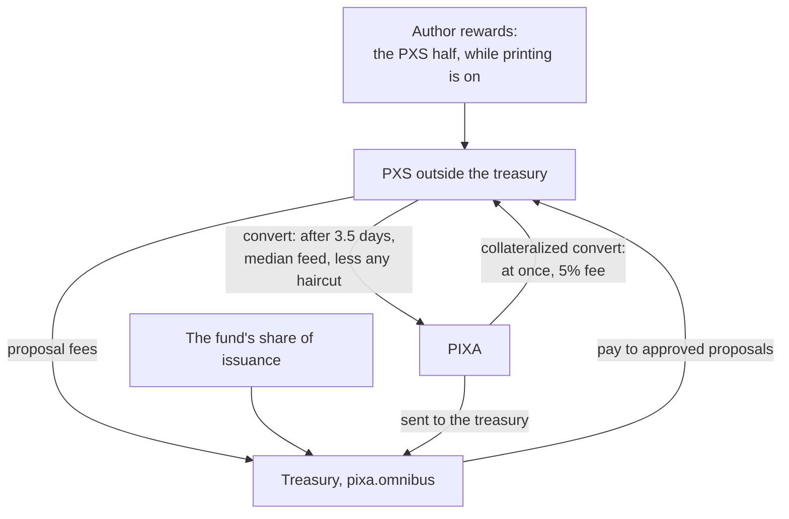

# PXS at a Glance

> **Status: Live.** PXS promises no price. It runs on the rules Hive applies to HBD, with interest fixed at zero and a price feed that refers to one Big Mac; while PIXA does not trade on any market, that feed is a placeholder. Figures read at block 917,250 on 2026-10-06.

This page is the short version of the Pixa Supra pages: what PXS does not promise, what it is, what you can do with it, and where it stands today. The pages it links to go into each part.

## What PXS does not promise

- **No price.** Nothing defends a PXS price, and no one has to buy PXS back at any value.
- **No claim.** A PXS balance is not a claim on any person, company or fund, for any amount.
- **No reserve.** No managed pool of assets stands behind PXS. The fund that holds most PXS holds PXS itself, not assets behind it.
- **No interest.** The chain fixes the interest rate on PXS at zero, in savings too.

What a PXS can do is convert. The protocol turns it into PIXA after 3.5 days, at the median of the witnesses' price feeds, reduced by a haircut when the PXS outside the treasury grows large against all PIXA. The haircut can fall toward zero ([Haircut, Corridor and Settlement](haircut-corridor-and-settlement.md)).

## What PXS is

In one phrase, PXS is a *Big Mac referenced supracoin* ([Glossary](../21-reference/glossary.md#supracoin)):

- **Big Mac referenced.** Each witness publishes how many PIXA one Big Mac costs, and the chain takes the median. That figure is the reference: the direction PXS is oriented toward, not a value it promises ([Oracle and Price Feed](oracle-and-price-feed.md)).
- **Supracoin.** The PXS design notes' name for a unit that orients toward purchasing power without a peg, a claim at par or an issuer ([Supracoin vs Stablecoin](supracoin-vs-stablecoin.md)). <!-- retired-ok -->
- **Settled in PIXA.** Conversion is the only settlement the protocol offers. A converted PXS becomes newly created PIXA, so what it is worth rests on PIXA, the base the design calls the Atlas ([The Four Components](the-four-components.md)).

On chain, PXS runs on the rules Hive applies to HBD. Pixa changed two of them: interest is fixed at zero, and a price sample needs fewer feeds while fewer witnesses run. It also seeded the treasury with PXS at genesis. The Big Mac reference lives in the witnesses' feed software, not in the chain's code ([From SBD to PXS](from-sbd-to-pxs.md#what-pixa-kept-and-changed)).

## How PXS enters and leaves

| To | Operation | What happens |
|---|---|---|
| Turn PXS into PIXA | `convert` | 3.5 days later, the chain burns the PXS and pays PIXA at the median feed then in force, less any haircut. No fee. |
| Turn PIXA into PXS | `collateralized_convert` | You lock twice the value in PIXA and receive the PXS at once, less a 5% fee. After 3.5 days the chain burns the PIXA the PXS cost and returns the rest. Refused while printing is stopped. |
| Send it | `transfer`, `recurrent_transfer` | As with PIXA. |
| Keep it in savings | `transfer_to_savings` | No interest. Withdrawals take 3 days. |
| Pay a proposal fee | `create_proposal` | 10 PXS, plus 1 PXS for each day beyond 60; paid into the fund ([Decentralized Pixa Fund](../07-governance/decentralized-pixa-fund.md#proposing)). |
| Trade it | `limit_order_create` | The chain has an order book for PIXA against PXS. On 2026-10-06 it held no orders and showed no trades. |

The values, with their sources in the code, are on [Chain Parameters](../21-reference/chain-parameters.md#pixa-supra-pxs-and-the-price-feed).

## PXS on 2026-10-06

| | Value |
|---|---|
| PXS in existence | 251,680.531 PXS |
| held by the treasury, `pixa.omnibus` | 249,266.219 PXS, 99.04% |
| outside the treasury | 2,414.312 PXS: 1,367.458 in the balances of 23 accounts, and 1,046.854 in four conversions waiting to settle |
| Median feed | 51.833 PIXA per PXS, a placeholder |
| Collateral ratio | about 804 ([how it is computed](haircut-corridor-and-settlement.md#three-numbers-decide-everything)) |
| Debt ratio | 0.124% |
| PXS printing | on: `pxs_print_rate` is 10000 |
| Haircut | not in force: the current and market medians are equal |
| Market | no orders and no trades |

Read with `condenser_api.get_dynamic_global_properties` (`current_pxs_supply`, `pxs_print_rate`), `condenser_api.get_accounts`, `database_api.list_accounts`, `database_api.list_hbd_conversion_requests`, `condenser_api.get_feed_history`, `condenser_api.get_order_book` and `condenser_api.get_ticker`.

Two facts shape these numbers:

- **The median is a placeholder.** PIXA does not trade on any market yet. Every witness divides the US price of a Big Mac, 6.22 USD, by 0.12 USD, an agreed placeholder for one PIXA. The collateral ratio and the distance to every threshold are therefore computed from an assumption, not from a market ([why](oracle-and-price-feed.md#the-placeholder)).
- **The treasury holds almost all PXS.** Its PXS counts in neither ratio. Paid out to proposals and held, it would: if all of it left the treasury, the collateral ratio would be about 7.7 at today's median ([where the network stands](haircut-corridor-and-settlement.md#where-the-network-stands)).

## Where the design and the chain differ

| | PXS design notes (June 2026) | The chain, 2026-10-06 |
|---|---|---|
| Witnesses | 21 elected | up to 21 elected, 1 required; 9 today |
| Reference | a basket of goods, "a Big Mac, a coffee" | one Big Mac, defined in the feed software, not in consensus |
| Inputs | "no external or commercial feed enters the loop" | the feed in use reads The Economist's index; the agnostic feed, not yet in use, adds ECB rates and an exchange ticker |
| Market reading | witnesses report real prices | a placeholder while PIXA does not trade |
| Haircut starts | below a collateral ratio of 3 | below 7/3, about 2.33 |
| Printing stops | not described | at a collateral ratio of 4 |
| Upper threshold | at 10, the corridor "becomes amendable by consensus" | none; every threshold changes only by hardfork |
| Origin of the thresholds | a "mutation" of Hive's debt cap | Hive's debt limits, unchanged |

## Where to go next

- [Supracoin vs Stablecoin](supracoin-vs-stablecoin.md): what the category means, and what it does not. <!-- retired-ok -->
- [The Four Components](the-four-components.md): the Oracle, the Atlas, the Supra and the Macro, and where each sits on chain.
- [Oracle and Price Feed](oracle-and-price-feed.md): how the witnesses' feeds become the median.
- [Haircut, Corridor and Settlement](haircut-corridor-and-settlement.md): the conversion rules, the thresholds and their arithmetic.
- [From SBD to PXS](from-sbd-to-pxs.md): what ten years of SBD and HBD show.
- The design's vocabulary: [Viable System Model](../06-economic-cybernetics/viable-system-model.md), [Variety and Regulation](../06-economic-cybernetics/variety-and-regulation.md), [Resilience and Cascades](../06-economic-cybernetics/resilience-and-cascades.md).

## Inherited → changed

| | Steem / Hive | Pixa |
|---|---|---|
| Second unit | SBD / HBD | PXS |
| What its feed refers to | one US dollar | one Big Mac |
| Interest | set by witnesses; on Hive, savings only | none, fixed by consensus |
| Conversion into the liquid token | 3.5 days at the median, less the haircut | same |
| Conversion from the liquid token | Steem: none; Hive: collateralized, since hardfork 25 | collateralized, since genesis |
| Debt limits | Hive: printing stops at 20%, haircut above 30% | same |
| Feeds needed for a price sample | 7 | a quorum of the scheduled witnesses |
| Treasury at launch | Hive: Steem's treasury balance and 328 excluded accounts | 245,098.039 PXS, seeded at genesis |

## Sources

- **Rules and code references:** [Chain Parameters](../21-reference/chain-parameters.md#pixa-supra-pxs-and-the-price-feed) and [Haircut, Corridor and Settlement](haircut-corridor-and-settlement.md#sources).
- **Live values,** read in one batch request at block 917,250 on 2026-10-06 09:14 UTC, with the calls named above.
- **PXS design notes** (Pixagram, June 2026), Part IV and its table of technical parameters.
- [Hive whitepaper](https://hive.io/whitepaper.pdf), §II.1 "Assets" and §III.4 "Price Feed Consensus".
