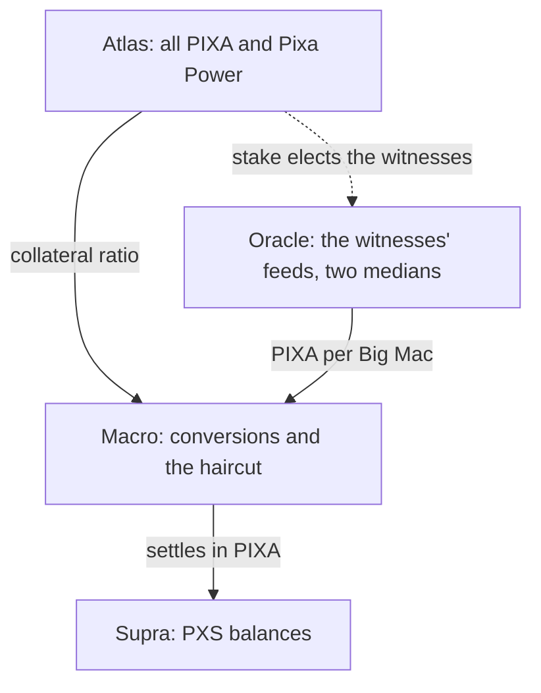

# The Four Components

> **Status: Live**, with differences from the design. The four-part model comes from the PXS design notes (June 2026); this page matches each part to what runs on chain. Figures read at block 917,250 on 2026-10-06.

PXS promises no price. The design notes describe what it is instead as a relation between four parts: an **Oracle** that senses, an **Atlas** that bears, a **Macro** that regulates and a **Supra** that is observed. None of the four is PXS by itself. This page explains each part, shows where it sits in the chain's code and data, and marks where the model and the chain differ.

## The model

The design orders the parts causally. Without the Atlas, there is nothing for the Supra to rest on; without the Oracle, no reference to orient by; without the Macro, nothing to reconcile the two; without the Supra, nothing to observe. Its summary: "the Oracle senses, the Atlas bears, the Macro regulates, the Supra is observed".

## One rule: adjust, never defend

The design states one law for the whole: "Pixa never defends; Pixa adjusts." On chain this means three things:

- **The chain never trades.** No code buys or sells PXS or PIXA, and the protocol has no account that trades.
- **When PXS grows large against PIXA, the chain adjusts in two steps.** At a debt ratio of 20% it stops paying authors in PXS and refuses new PIXA → PXS conversions. Above 30% it lowers what each PXS converts into: the haircut ([Haircut, Corridor and Settlement](haircut-corridor-and-settlement.md)). The fund's share of issuance still arrives as PXS, and approved proposals are still paid from the fund, so the PXS outside the treasury can keep growing.
- **Both steps are automatic,** and they apply to every holder at once. The thresholds are on [Chain Parameters](../11-reference/chain-parameters.md#pixa-supra-pxs-and-the-price-feed).

## Oracle: the sensor

**In the design.** Elected witnesses report real prices. A median across witnesses rejects a wrong reporter, and a median over 84 hours rejects a short spike. The Oracle is self-referential, because stake elects the witnesses, and its basket can be replaced by consensus. It reports "which way to lean", not a price PXS will reach.

**On chain.** Each witness publishes one number, PIXA per PXS (`feed_publish`). Every hour the chain keeps the middle feed of the scheduled witnesses, and conversions use the median of the last 84 such samples ([Oracle and Price Feed](oracle-and-price-feed.md)).

**Where they differ.**

- **One good, not a basket.** The software reads the price of a Big Mac only.
- **The basket lives outside consensus.** It is defined in each witness's software, so it changes without a vote.
- **Outside inputs.** The feed in use reads The Economist's index; the agnostic feed would add the ECB's rates and an exchange's ticker.
- **A placeholder.** While PIXA does not trade, every feed divides by the same agreed price, and the Oracle reads no market at all.

## Atlas: the collateral base

**In the design.** The network's own substance, PIXA and Pixa Power, the same token in two phases: liquid, and staked with a 13-week power-down. It is not a reserve set aside for PXS holders, and no one can top it up or draw it down to support PXS. It is volatile, because the activity it stands for is.

**On chain.** The Atlas is *P*, the chain's `current_supply`: every PIXA, liquid or staked, including the reward fund. On 2026-10-06 it was 100,675,253.214 PIXA. The chain values it at the median feed when it computes the collateral ratio ([three numbers](haircut-corridor-and-settlement.md#three-numbers-decide-everything)).

**Where they differ.**

- **Who holds it.** The design speaks of a creative economy. On 2026-10-06, 67,990,000 VESTS, about 67.5% of all PIXA, were the stake of the two allocation accounts, `pixa.rex` and `pixa.team`, still to be distributed ([Genesis and Distribution](../04-tokens-and-economy/genesis-and-distribution.md#where-the-stake-is-now)).
- **What it is worth.** The chain counts PIXA and values PXS against it at the median, which rests on the placeholder. What the Atlas would bear in a market depends on how many buyers PIXA finds, including as the allocations are distributed over the coming years.
- **Who can change it.** No account can add to it or take from it to support PXS. The protocol itself changes it every block: issuance adds PIXA, fees and conversions into PXS burn some, and conversions out of PXS create more ([Supply, Inflation and Yield](../04-tokens-and-economy/supply-inflation-and-yield.md)).

## Supra: what a holder holds

**In the design.** The observable: "a projection of the Atlas read through the Oracle". The holder holds neither a slice of any basket nor a claim against anyone, but the regulated relation itself, which settles in PIXA at the haircut. "Underlying" is the wrong word, the notes say, because the Supra and the Atlas are one body seen in two registers.

**On chain.** A PXS balance: liquid, in savings, unclaimed in a reward balance, inside a pending conversion or in an open order. The protocol settles it in only one way, by converting it into PIXA that it creates for the purpose. 2,414.312 PXS were outside the treasury on 2026-10-06, held by 23 accounts and four pending conversions ([PXS at a Glance](pxs-at-a-glance.md#pxs-on-2026-10-06)).

**Where they differ.** Nowhere in substance, and the chain makes the notes' point concrete. What a PXS is worth depends on the feed being right, on the Atlas being large enough to keep the haircut away, and on a market for the PIXA it converts into. A holder cannot separate PXS from PIXA.

## Macro: the regulated flow

**In the design.** The regulator: a flow, not a stock, and the one part that can be acted on. The Atlas cannot be commanded, the supply is never minted or burned to chase a price, and the Supra is defined by the others. Only the Macro moves, and the haircut moves it.

**On chain.** These are the flows that create or remove PXS:

| Flow | Effect | Rule |
|---|---|---|
| Author rewards, the PXS half | creates PXS instead of PIXA | only while printing is on, under a debt ratio of 20% |
| The fund's share of issuance | creates PXS in the treasury | every block, at the median feed |
| PIXA → PXS (`collateralized_convert`) | creates PXS, burns PIXA | 5% fee; refused once printing stops |
| PXS → PIXA (`convert`) | burns PXS, creates PIXA | at the median feed, less the haircut |
| PIXA sent to the treasury | burns PIXA, creates PXS in the treasury | at once, at the median feed |
| Proposal pay and proposal fees | move PXS out of and into the treasury | votes; at most 1% of the fund a day |

The totals since genesis are on [Supply, Inflation and Yield](../04-tokens-and-economy/supply-inflation-and-yield.md#where-pixa-is-destroyed) and [Decentralized Pixa Fund](../07-governance/decentralized-pixa-fund.md#where-the-money-comes-from).

**Where they differ.** The design treats the haircut as the single lever. The chain has two: the print stop at 20%, which closes the inflows from author rewards and collateralized conversions, and the haircut above 30%, which shrinks the flow out of PXS. The fund's share and proposal pay continue under both. Neither lever has acted since genesis.

## The model against the chain

| | PXS design notes | The chain, 2026-10-06 |
|---|---|---|
| Oracle | a basket read by 21 elected witnesses; no outside feed | one good, read by up to 21 elected witnesses, 9 today; an outside index; a placeholder for PIXA |
| Atlas | PIXA and Pixa Power, a creative economy | PIXA and Pixa Power; about two thirds still held by the allocation accounts |
| Supra | a projection of the Atlas through the Oracle | PXS balances, settled only by conversion into new PIXA |
| Macro | one lever, the haircut, over a corridor of 3 to 10 | two levers: the print stop at a collateral ratio of 4 and the haircut below 2.33 |
| The rule | never defend, adjust | holds: the chain trades nothing and only changes rates and gates |

## Inherited → changed

| | Steem / Hive | Pixa |
|---|---|---|
| How the debt token is described | a convertible note aimed at one US dollar, with interest | four components and one rule |
| Sensor | witnesses' feeds of the liquid token's price in US dollars | witnesses' feeds of PIXA per Big Mac |
| Collateral base | all HIVE | all PIXA |
| Levers | print stop at 20%, haircut above 30% (Hive) | same |

## Sources

- **PXS design notes** (Pixagram, June 2026), Part IV and Annex A.
- **Code**, at commit [`48f75a2`](https://github.com/pixagram-blockchain/pixagram/tree/48f75a28840c24e5a5b42ccb4f94dc8668ecb443): the references are on [Haircut, Corridor and Settlement](haircut-corridor-and-settlement.md#sources) and [Oracle and Price Feed](oracle-and-price-feed.md#sources).
- **Live values,** read on 2026-10-06: `condenser_api.get_dynamic_global_properties` at block 917,250; `condenser_api.get_accounts` for `pixa.rex` and `pixa.team` at block 916,161.
