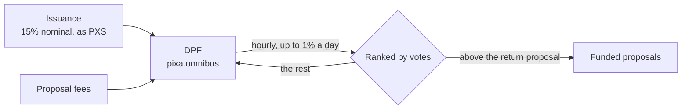

# Decentralized Pixa Fund

> **Status: Live.** The fund held 249,307.037 PXS on 2026-10-05, read at 15:52 UTC. One proposal was being paid.

The Decentralized Pixa Fund (DPF) is the community's treasury. It is held by `pixa.omnibus`, an account with no keys, and it pays only proposals that stakeholders vote for. This page explains where the fund's money comes from, how it decides what to pay, what it pays today, and how to propose or vote.

## Where the money comes from

| Source | Since genesis, to 2026-10-05 15:00 UTC |
|---|---|
| Seed at genesis | 245,098.039 PXS |
| Share of issuance: 15% nominal, converted to PXS in every block | 1,778.751 PXS; 57.6 PXS a day now |
| Proposal fees, which are paid into the fund | 3,661.000 PXS from three proposals |
| PIXA sent to the fund, converted to PXS at once | none so far |
| Paid out to proposals | −1,232.827 PXS |
| **Balance** | **249,304.963 PXS** |

**What the fund actually receives from issuance.** The fund's share is converted to PXS at the median feed and rounded down to 0.001 PXS in every block. On 2026-10-05 it received 0.002 PXS a block, about 74% of its nominal share. If the median rose above about 140 PIXA per PXS at today's issuance, the share would round down to nothing ([Supply, Inflation and Yield](../04-tokens-and-economy/supply-inflation-and-yield.md#where-new-tokens-go)).

## How it pays

1. **Once an hour**, the chain counts the votes on every active proposal and ranks them.
2. **The budget** is 1% of the fund's balance per day, spread over the hours: about 2,493 PXS a day on 2026-10-05.
3. **Payment runs down the ranking.** Each proposal receives its daily pay for the hour, starting with the most-voted, until the budget runs out.
4. **The return proposal sets the threshold.** Proposal 2 pays its receiver, the fund itself, and asks for 1,000,000 PXS a day, so it takes whatever budget is left. Any proposal with fewer votes than it receives nothing. Its vote total is therefore the funding threshold. Its payments to the fund, 25,946.984 PXS so far, cancel out.

The fund cannot be spent any other way. No person, company or foundation holds its keys ([System Accounts](../11-reference/system-accounts.md#the-treasury-pixaomnibus)).

## Proposals on 2026-10-05

| | Proposal 1 | Proposal 2 |
|---|---|---|
| For | Account creation fees and SMS verification for new accounts | The funding threshold: this is the return proposal |
| Receiver | `rex` | `pixa.omnibus`, the fund itself |
| Pay | 110.000 PXS a day | 1,000,000.000 PXS a day, returned to the fund |
| Runs | 2026-09-24 to 2026-12-31 | 2026-09-24 to 2036-09-24 |
| Votes | 11.217 million VESTS, from 4 accounts | 7.761 million VESTS, from 1 account with stake |
| State | **Funded** | Threshold |

- **Proposal 1** had received 1,232.827 PXS by 15:00 UTC, paid as 4.583 PXS every hour. Its pay is about 4% of the daily budget. The rest of the budget returns to the fund.
- **Proposal 0**, a one-day proposal in September 2026, has expired.
- **The fund is shrinking slowly.** It receives 57.6 PXS a day and pays out 110, so it shrinks by about 52 PXS a day while proposal 1 runs.

## Proposing

1. **Write the proposal as a post.** In the app, write it in the Proposals portal (`portal-156480`). Set the daily pay and the dates, and the app creates the proposal on chain after publishing the post.
2. **Or create it directly.** Broadcast `create_proposal`, signed with your active key. It names:
   - a creator and a receiver
   - a start date and an end date
   - a daily pay in PXS
   - a subject of at most 80 bytes
   - the permlink of a post by the creator or the receiver
3. **Pay the fee.** It is 10 PXS, plus 1 PXS for each day the proposal runs beyond 60 days. A ten-year proposal costs 3,603 PXS. The fee goes into the fund.
4. **Change it later.** With `update_proposal` you can lower the daily pay, bring the end date forward, or change the subject and post. You cannot raise the pay or extend the end date. With `remove_proposal` you can withdraw the proposal.

## Voting

- **How.** In the app, use the proposals tab under Governance → Viability Management ([step by step](../08-guides/take-part-in-governance.md#vote-on-proposals)). Directly, broadcast `update_proposal_votes` with your active key. It covers up to 5 proposals at a time, all approved or all unapproved.
- **Weight.** The same governance weight as witness votes: your own Pixa Power, less stake still in its 30-day wait, plus any proxied to you ([Witnesses and DPoS](witnesses-and-dpos.md#how-witnesses-are-elected)). If you have named a proxy, your proxy's proposal votes count for you and your own do not.
- **Limits.** You cannot vote for a proposal that has ended. Votes lapse with 365 days of governance inactivity.

## What to keep in mind

- **Few voters.** On 2026-10-05, four accounts voted for the funded proposal, and a single account set the threshold ([Decentralization and Safeguards](decentralization-and-safeguards.md)).
- **The fund pays in PXS.** PXS promises no price. A recipient who converts PXS receives PIXA at the median feed in force 3.5 days later, less any haircut. Today that feed is a placeholder ([Haircut, Corridor and Settlement](../05-pixa-supra/haircut-corridor-and-settlement.md#converting-pxs-into-pixa)). PXS paid out of the fund also counts in the debt ratio, which the fund's own PXS does not ([why it matters](../05-pixa-supra/haircut-corridor-and-settlement.md#where-the-network-stands)).
- **A proposal is a public promise, not a contract.** The chain pays a proposal while it ranks above the threshold. It does not check that the work is done. Stakeholders can withdraw their votes at any hour.

## Inherited → changed

| | Steem / Hive | Pixa |
|---|---|---|
| Name | Steem Proposal System; Decentralized Hive Fund | Decentralized Pixa Fund |
| Account | `steem.dao`, then `hive.fund` | `pixa.omnibus`, which has no keys |
| Share of issuance | Hive: 10% | 15% nominal, reduced by rounding |
| Paid in | HBD | PXS |
| Return proposal | id 0 | id 2 |
| Seed at launch | Hive: Steem's treasury balance, plus the balances of 328 excluded accounts | 245,098.039 PXS |
| Budget, fee, voting rules | 1% a day; 10 + 1 a day beyond 60; 5 proposals per vote | same |

## Sources

- [Hive whitepaper](https://hive.io/whitepaper.pdf), §II.5.
- **Code**, at commit [`48f75a2`](https://github.com/pixagram-blockchain/pixagram/tree/48f75a28840c24e5a5b42ccb4f94dc8668ecb443):
  - vote counting and ranking: [dhf_processor.cpp:88-136](https://github.com/pixagram-blockchain/pixagram/blob/48f75a28840c24e5a5b42ccb4f94dc8668ecb443/libraries/chain/util/dhf_processor.cpp#L88-L136)
  - budget and payments: [dhf_processor.cpp:145-286](https://github.com/pixagram-blockchain/pixagram/blob/48f75a28840c24e5a5b42ccb4f94dc8668ecb443/libraries/chain/util/dhf_processor.cpp#L145-L286)
  - creating, changing and voting on proposals: [dhf_evaluator.cpp:32-211](https://github.com/pixagram-blockchain/pixagram/blob/48f75a28840c24e5a5b42ccb4f94dc8668ecb443/libraries/chain/dhf_evaluator.cpp#L32-L211)
  - the fund's share of issuance: [database.cpp:1781-1800](https://github.com/pixagram-blockchain/pixagram/blob/48f75a28840c24e5a5b42ccb4f94dc8668ecb443/libraries/chain/database.cpp#L1781-L1800)
  - constants: [Chain Parameters](../11-reference/chain-parameters.md#decentralized-pixa-fund-dpf)
- **Live chain**, read on 2026-10-05:
  - `database_api.list_proposals` and `database_api.list_proposal_votes`
  - the history of `pixa.omnibus`: `dhf_funding`, `proposal_fee` and `proposal_pay` operations
- **App**: the proposal fee in [`SettingsPanel.js:29-36`](https://github.com/pixagram-blockchain/pixagram-ui-dev/blob/ca1d15762b52ec08f33c69ca9afa34bb78c0df52/src/js/components/editor/SettingsPanel.js#L29-L36); the return proposal and the budget figures in [`GDVMProposals.js:68-72`](https://github.com/pixagram-blockchain/pixagram-ui-dev/blob/ca1d15762b52ec08f33c69ca9afa34bb78c0df52/src/js/components/GDVMProposals.js#L68-L72) and [`1082-1103`](https://github.com/pixagram-blockchain/pixagram-ui-dev/blob/ca1d15762b52ec08f33c69ca9afa34bb78c0df52/src/js/components/GDVMProposals.js#L1082-L1103).
