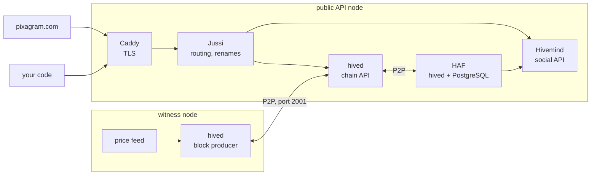

# Chain Architecture

> **Status: Live.** Describes hived 1.29.0 and the public API stack of the `pixagram-node` repository at commit `7e57cca`. Checked against the six public nodes on 2026-10-05.

This page shows the parts of the Pixa network a developer talks to, what each part does, and where each kind of data lives. Read it before the [Developer Quickstart](developer-quickstart.md) if you are new to Hive-family chains, or before running a node ([Run a Node](../10-node-operators/run-a-node.md)).

## The parts at a glance

| Part | What it is | Consensus? |
|---|---|---|
| **hived** | The node software, built from Hive's code. It validates and stores blocks, keeps the chain's current state and answers chain API calls. Every node runs it. | Yes |
| **Witness node** | A hived with the `witness` plugin and a block-signing key. It produces a block when its turn comes ([Witnesses and DPoS](../07-governance/witnesses-and-dpos.md)). | Yes |
| **HAF** | Hive Application Framework: a second hived that writes every block into PostgreSQL. | No |
| **Hivemind** | The social indexer. It reads HAF's database and answers `bridge.*`, `follow_api.*`, `tags_api.*` and some `condenser_api.*` calls: feeds, follows, communities, notifications. | No |
| **Jussi** | The gateway in front of both. It sends each call to hived or Hivemind and renames Hive's field names to Pixa's ([Differences from Hive](differences-from-hive.md#the-public-api)). | No |
| **Caddy** | Terminates TLS, obtains certificates and compresses responses. | No |
| **Price feed** | A program each witness runs to publish the PIXA price of one Big Mac every hour ([Oracle and Price Feed](../05-pixa-supra/oracle-and-price-feed.md#the-agnostic-feed)). | Its output is input to consensus; the program is not |
| **Clients** | The Pixagram app and any other program. They sign transactions locally and send them over HTTPS. | No |

Six public API nodes run this stack on 2026-10-05: `api.pixagram.com`, `pixarex.net`, `merlion.surf`, `blockforge.lol`, `boitata.quest` and `pixa-dubai.xyz`. They serve the same chain and answer identically.

## The chain: blocks, transactions, operations

| Term | Meaning |
|---|---|
| **Block** | A batch of transactions signed by one witness. One every 3 seconds ([Chain Parameters](../11-reference/chain-parameters.md#blocks-and-witnesses)). |
| **Transaction** | One or more operations, signed together. It names a recent block (`ref_block_num`, `ref_block_prefix`) and an expiry, so it cannot be replayed on another fork or later. |
| **Operation** | One action: `comment` publishes a post or an artwork, `vote` votes, `transfer` moves tokens, `custom_json` carries app data such as follows and community actions. |
| **Virtual operation** | A record the chain writes itself when a rule applies, such as `author_reward` at payout or `producer_reward` for a block. Nobody signs it. |
| **Irreversible block** | A block confirmed by a supermajority of the scheduled witnesses, so that it can no longer be undone. |

**Signatures stay with the client.** A client builds a transaction, signs it with a private key and sends only the signed result. No node and no gateway ever sees a key. A signature covers the chain ID, so a transaction signed for Pixa is invalid on Hive and the other way round.

**Rules are compiled in.** Every hived enforces the same rules. Witnesses change some parameters by vote; everything else changes only when they run a new version ([Protocol Upgrades](../07-governance/protocol-upgrades.md)).

## What a node keeps on disk

| Path in the data directory | What it holds | If lost |
|---|---|---|
| `blockchain/block_log*` | Every block since genesis. This *is* the chain. | Download it again over P2P. |
| `blockchain/shared_memory.bin` | The current state: accounts, balances, votes, witnesses, proposals, posts awaiting payout | Rebuilt from the block log by a replay |
| `blockchain/comments-rocksdb-storage` | Posts and comments after their payout, moved out of the state file | Rebuilt by a replay |
| `blockchain/account-history-rocksdb-storage` | Each account's operations, on API nodes only | Rebuilt by a replay |
| `config.ini` | The node's settings, and on a witness its signing key | **Cannot be rebuilt.** Back it up. |

Plugins decide what a node indexes and which API calls it answers. A witness node loads four; a public API node loads eleven ([Run a Node](../10-node-operators/run-a-node.md#choose-the-plugins)).

## How a read travels

1. The client sends an HTTPS `POST` with a JSON-RPC body, for example `{"method":"condenser_api.get_accounts", …}`.
2. Caddy terminates TLS and passes the request to Jussi.
3. Jussi reads the method name. `bridge`, `follow_api` and `tags_api` calls, and 23 named `condenser_api` calls such as `get_content` and `get_discussions_by_created`, go to Hivemind. Everything else goes to hived, after Jussi renames Pixa field names in the request to Hive's.
4. On the way back, Jussi renames Hive field names to Pixa's, such as `hbd_balance` to `pxs_balance`, and Caddy compresses the response.

## How a write travels

1. The client reads the head block (`get_dynamic_global_properties`), builds a transaction that references it, and signs it locally.
2. It sends the signed transaction with `condenser_api.broadcast_transaction`. hived checks the signatures against the account's keys, and the [Resource Credits](../04-tokens-and-economy/resource-credits.md) the transaction costs, then passes it to its peers.
3. The next witness to produce a block includes it, usually within 3 seconds. The transaction becomes irreversible once enough witnesses have built on that block.
4. HAF writes the block into PostgreSQL, and Hivemind indexes it. From then on the post, vote or follow appears in `bridge.*` results.

## Where each kind of data lives

| Data | Where | On chain? |
|---|---|---|
| Artworks, posts, comments, votes, transfers | Blocks, in every node's block log | Yes |
| Balances, keys, witness votes, proposals | hived's state, derived from the blocks | Yes, as derived state |
| Follows, mutes, reblogs, community roles | `custom_json` operations in blocks; Hivemind keeps their current effect | The operations are; Hivemind's tables are an index |
| Feeds, rankings, notifications | Hivemind's database | No, computed |
| Images inside blog posts | Arweave, through a project upload service; the post holds a link | No ([Pixel Art On Chain](../03-art-on-chain/pixel-art-on-chain.md#images-that-live-elsewhere)) |
| AI conversions, search, the image proxy | Services run for the app | No |

Anything marked *No* can be rebuilt or replaced without the chain changing. An app that reads blocks directly needs none of it.

## Compared with Hive

| | Steem / Hive | Pixa |
|---|---|---|
| Node software | hived (Hive), steemd (Steem) | hived 1.29.0, a fork of Hive's 1.28.7 |
| Social indexer | Hivemind; on Hive, built on HAF | the same, built on HAF |
| Gateway called Jussi | a Python service that routes calls | an OpenResty (nginx and Lua) configuration that routes calls and renames fields |
| Field names in API responses | `hbd_balance`, `reward_hive` … on Hive | `pxs_balance`, `reward_pixa` … through the gateway; Hive's names from hived directly |

## Sources

- Gateway: [`jussi/nginx.conf`](https://github.com/pixagram-blockchain/pixagram-node/blob/7e57cca075d51a3ac1cf3065d367581a3efe56c6/jussi/nginx.conf) (routing at lines 18-51, renames at 63-117), [`docker-compose.yml`](https://github.com/pixagram-blockchain/pixagram-node/blob/7e57cca075d51a3ac1cf3065d367581a3efe56c6/docker-compose.yml) and [`ssl-proxy/Caddyfile`](https://github.com/pixagram-blockchain/pixagram-node/blob/7e57cca075d51a3ac1cf3065d367581a3efe56c6/ssl-proxy/Caddyfile), at commit `7e57cca`.
- Witness node: [`witness`](https://github.com/pixagram-blockchain/witness/tree/51938966c3714908a10f158be197064c2d16d94b) at commit `5193896`.
- Node software: [`pixagram-blockchain/pixagram`](https://github.com/pixagram-blockchain/pixagram/tree/48f75a28840c24e5a5b42ccb4f94dc8668ecb443) at commit `48f75a2`.
- Public nodes: the app's node list in [`constants.js`](https://github.com/pixagram-blockchain/pixagram-ui-dev/blob/ca1d15762b52ec08f33c69ca9afa34bb78c0df52/src/js/utils/constants.js#L94); each answered `condenser_api.get_dynamic_global_properties` and `bridge.get_ranked_posts` on 2026-10-05.
- [Hive whitepaper](https://hive.io/whitepaper.pdf) (2020), §III.5 "Node Types" and §IV.1 "Integration"; [Steem whitepaper](https://steem.com/steem-whitepaper.pdf), "Consensus in Steem".
- Comment archive: [`rocksdb_comment_archive.cpp`](https://github.com/pixagram-blockchain/pixagram/blob/48f75a28840c24e5a5b42ccb4f94dc8668ecb443/libraries/chain/external_storage/rocksdb_comment_archive.cpp), called at payout from [`database_comment.cpp:118`](https://github.com/pixagram-blockchain/pixagram/blob/48f75a28840c24e5a5b42ccb4f94dc8668ecb443/libraries/chain/database_comment.cpp#L118).
