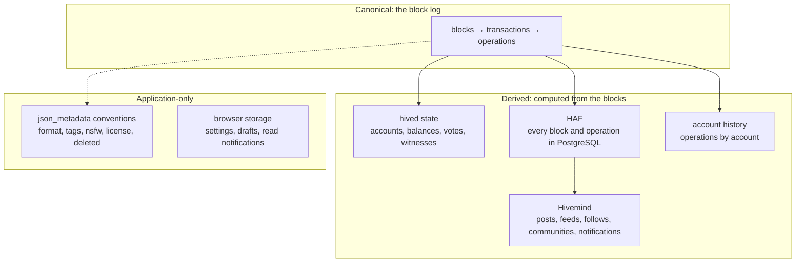

# Data Model

> **Status: Live.** Describes hived 1.30.0, Hivemind at commit `5765e21` and the app's code of 2026-10-04. Field names were checked against `api.pixagram.com` on 2026-10-08.

The Pixa chain stores one thing: blocks. Everything else, from an account's balance to a trending feed, is computed from them by some program, and each program keeps its own tables. This page lays out the three layers: the **canonical** data in the blocks, the **derived** state that hived, HAF and Hivemind compute from it, and the **application-only** data that exists in the Pixagram app's conventions and in a user's browser. It names the objects and fields a developer meets and says where each one lives, so that nobody mistakes an app convention for a rule of the chain.

## The three layers



| Layer | Who writes it | If it were lost | Example |
|---|---|---|---|
| **Canonical** | Witnesses, one block every 3 seconds | The chain would be gone. Every node keeps a copy. | The `comment` operation that published an artwork |
| **Derived** | hived while applying blocks; HAF and Hivemind while reading them | Rebuilt by replaying the blocks, with the same result | The account's balance; the artwork's place in Trending |
| **Application-only** | The Pixagram app, following its own conventions; the user's browser | Nothing on chain changes; other apps may read the data differently | `"nsfw": false` in the artwork's metadata; the user's chosen currency |

The question to ask of any field: **which layer defines it?** A rule of the chain holds for every program. An indexer's field holds for programs that use that indexer. An app convention holds only for apps that follow it.

## Canonical: blocks, transactions, operations

### A block

| Field | Meaning |
|---|---|
| `previous` | The id of the block before; the chain of these ids is the chain |
| `timestamp` | UTC, a multiple of 3 seconds from genesis, 2026-09-04 12:00:00 |
| `witness` | The account that produced the block |
| `transaction_merkle_root` | A hash over the transactions, so that the header commits to them |
| `extensions` | Usually empty; carries a witness's `version` and `hardfork_version_vote` when they change ([Protocol Upgrades](../07-governance/protocol-upgrades.md)) |
| `witness_signature` | The producer's signature with its block-signing key |
| `transactions` | The signed transactions, in order |
| `block_id` | The first 20 bytes of the SHA-256 of the header; its first 4 bytes are the block number |
| `signing_key`, `transaction_ids` | Added by the API for convenience; not in the serialized block |

`block_api.get_block` returns one; `condenser_api.get_block` returns the same with legacy operation formatting.

### A transaction

`ref_block_num`, `ref_block_prefix`, `expiration`, `operations`, `extensions`, `signatures` ([Transaction Lifecycle](transaction-lifecycle.md#1-construction)). The transaction id is the first 20 bytes of the SHA-256 of the transaction without its signatures; it is not stored in the block, every program recomputes it.

### An operation

Fifty kinds, each a fixed set of fields ([Operations Reference](operations-reference.md)). In JSON an operation has two envelopes, and every API accepts both:

```json
["vote", {"voter": "alice", "author": "bob", "permlink": "horus-portrait-1790597187843", "weight": 10000}]
{"type": "vote_operation", "value": {"voter": "alice", "author": "bob", "permlink": "horus-portrait-1790597187843", "weight": 10000}}
```

The first is the legacy form, which `condenser_api` returns and the app uses; the second is the HF26 form, which `block_api`, `database_api` and `account_history_api` return. Amounts differ too: `"1.000 PIXA"` in the legacy form, `{"amount": "1000", "precision": 3, "nai": "@@000000021"}` in the HF26 form ([Differences from Hive](../09-developers/differences-from-hive.md#identity-and-assets)).

Virtual operations ([Operations Reference](operations-reference.md#virtual-operations)) are not in the blocks. They are hived's record of what its rules did while applying a block; the account history plugin stores them next to the block's operations, and HAF stores them in its own table, so that every indexer sees the same payout or reward without recomputing it.

### What a block does not contain

- **No balances, no state.** A block says "alice sent bob 5 PIXA"; it does not say what either balance is. Only a program that has applied every block knows.
- **No post text outside the operation.** The `comment` operation carries the title, body and `json_metadata` once. An edit is another `comment` operation with the whole new content. Nothing deletes the first version ([Permanence and Provenance](../03-art-on-chain/permanence-and-provenance.md)).
- **No files.** An artwork is in the body as a data URI ([Artwork Encoding Spec](../09-developers/artwork-encoding-spec.md)); an image inside a blog post is a link to a file somewhere else ([Pixel Art On Chain](../03-art-on-chain/pixel-art-on-chain.md#images-that-live-elsewhere)).
- **No reputation, no follows as such.** A follow is a `custom_json` operation whose meaning Hivemind assigns ([Feed and Discovery](../14-product/feed-and-discovery.md#following)); reputation is a number the `reputation_api` plugin and Hivemind each compute from votes.

## Derived: the hived state

hived keeps the current state in `shared_memory.bin` as indexed objects ([Chain Architecture](../09-developers/chain-architecture.md#what-a-node-keeps-on-disk)). `database_api` and `condenser_api` read them. The table names the objects and the fields a developer uses; it keeps Hive's names, which hived itself uses, and notes the Pixa name where the public nodes' gateway renames a field ([Field renames](../09-developers/differences-from-hive.md#field-renames)).

| Object | What it holds | Fields to know | Read with |
|---|---|---|---|
| `dynamic_global_property_object` | The chain's current totals and settings | `head_block_number`, `head_block_id`, `time`, `current_witness`, `last_irreversible_block_num`; `current_supply`, `current_hbd_supply` (`current_pxs_supply`), `total_vesting_fund_hive` (`total_vesting_fund_pixa`), `total_vesting_shares`, `pending_rewarded_vesting_shares`, `pending_rewarded_vesting_hive`; `hbd_print_rate` (`pxs_print_rate`), `hbd_interest_rate` (`pxs_interest_rate`), `hbd_start_percent`, `hbd_stop_percent`; `maximum_block_size`; `vote_power_reserve_rate`, `delegation_return_period`, `early_voting_seconds`, `mid_voting_seconds`, `downvote_pool_percent`, `available_account_subsidies`, `content_reward_percent`, `vesting_reward_percent`, `proposal_fund_percent`, `dhf_interval_ledger` (`dpf_interval_ledger`) | `condenser_api.get_dynamic_global_properties` |
| `account_object` | One account's balances, stake, mana, counters and recovery settings | `name`, `balance`, `hbd_balance` (`pxs_balance`), `savings_balance`, `savings_hbd_balance`, `reward_hive_balance`, `reward_hbd_balance`, `reward_vesting_balance`, `reward_vesting_hive`; `vesting_shares`, `delegated_vesting_shares`, `received_vesting_shares`, `vesting_withdraw_rate`, `to_withdraw`, `withdrawn`, `next_vesting_withdrawal`, `delayed_votes`; `voting_manabar`, `downvote_manabar`, `rc_manabar`, `delegated_rc`, `received_rc`; `witnesses_voted_for`, `proxy`, `can_vote`, `governance_vote_expiration_ts`; `last_post`, `last_root_post`, `last_vote_time`, `post_count`; `pending_claimed_accounts`, `open_recurrent_transfers`, `pending_escrow_transfers`, `savings_withdraw_requests`; `recovery_account`, `last_account_recovery`; `created`, `memo_key` | `condenser_api.get_accounts`, `database_api.find_accounts` |
| `account_authority_object` | The three authorities | `owner`, `active`, `posting`, each `{weight_threshold, account_auths, key_auths}`; `last_owner_update`, `previous_owner_update` | returned inside the account |
| `account_metadata_object` | The two metadata strings | `json_metadata`, `posting_json_metadata` | returned inside the account; the gateway's Hivemind route serves a sanitized `profile` |
| `comment_object` | A post's identity and place in its thread; **not its text** | `author_and_permlink_hash`, `parent_comment`, `depth` | Not served by hived; hived 1.28 and later leave posts to Hivemind, which serves them through `bridge.get_post` and `condenser_api.get_content` |
| `comment_cashout_object` | A post's reward state, until payout; then removed | `net_rshares`, `vote_rshares`, `total_vote_weight`, `net_votes`, `children`, `created`, `cashout_time`, `max_accepted_payout`, `percent_hbd` (`percent_pxs`), `allow_votes`, `allow_curation_rewards`, `was_voted_on`, `beneficiaries` | `database_api.get_comment_pending_payouts` (the reward fields); the rest through Hivemind |
| `comment_vote_object` | One vote on one post, until payout | `voter`, `comment`, `weight`, `rshares`, `vote_percent`, `last_update` | hived's `condenser_api.get_active_votes` reads it, but the public gateway routes that name to Hivemind, so from the public nodes the answer is Hivemind's copy; the `effective_comment_vote` virtual operation in the account history is the chain's record |
| `witness_object` | A witness's registration, key, feed and votes | `owner`, `created`, `url`, `signing_key`, `props` (`account_creation_fee`, `maximum_block_size`, `hbd_interest_rate`, `account_subsidy_budget`, `account_subsidy_decay`), `hbd_exchange_rate` (`pxs_exchange_rate`), `last_hbd_exchange_update`, `votes`, `schedule`, `total_missed`, `last_confirmed_block_num`, `running_version`, `hardfork_version_vote`, `hardfork_time_vote`, `available_witness_account_subsidies` | `condenser_api.get_witnesses_by_vote`, `get_witness_by_account` |
| `witness_schedule_object` | The current round and the median parameters | `num_scheduled_witnesses`, `current_shuffled_witnesses`, `median_props`, `majority_version`, `hardfork_required_witnesses`, `account_subsidy_rd` | `condenser_api.get_witness_schedule` |
| `witness_vote_object` | One account's approval of one witness | `account`, `witness` | `database_api.list_witness_votes` |
| `reward_fund_object` | The reward pool for posts | `name` (`post`), `reward_balance`, `recent_claims`, `last_update`, `content_constant`, `percent_curation_rewards`, `author_reward_curve`, `curation_reward_curve` | `condenser_api.get_reward_fund` |
| `feed_history_object` | The price feed's medians | `current_median_history`, `market_median_history`, `current_min_history`, `current_max_history`, `price_history` (84 hourly entries) | `condenser_api.get_feed_history` |
| `proposal_object`, `proposal_vote_object` | A DPF proposal and the approvals | `proposal_id`, `creator`, `receiver`, `start_date`, `end_date`, `daily_pay`, `subject`, `permlink`, `total_votes`, `status`; `voter`, `proposal` | `database_api.list_proposals`, `list_proposal_votes` |
| `convert_request_object`, `collateralized_convert_request_object` | Conversions waiting to settle | `owner`, `requestid`, `amount`, `conversion_date`; plus `collateral_amount`, `converted_amount` | `database_api.find_collateralized_conversion_requests`, `condenser_api.get_conversion_requests` |
| `savings_withdraw_object` | A savings withdrawal in its 3 days | `from`, `to`, `memo`, `request_id`, `amount`, `complete` | `condenser_api.get_savings_withdraw_from` |
| `vesting_delegation_object`, `vesting_delegation_expiration_object` | Stake lent, and stake on its way back | `delegator`, `delegatee`, `vesting_shares`, `min_delegation_time`; `expiration` | `condenser_api.get_vesting_delegations`, `get_expiring_vesting_delegations` |
| `withdraw_vesting_route_object` | A power-down route | `from_account`, `to_account`, `percent`, `auto_vest` | `condenser_api.get_withdraw_routes` |
| `recurrent_transfer_object` | A repeating transfer | `from`, `to`, `amount`, `memo`, `recurrence`, `trigger_date`, `remaining_executions`, `consecutive_failures`, `pair_id` | `condenser_api.find_recurrent_transfers` |
| `escrow_object` | An escrow | `from`, `to`, `agent`, `escrow_id`, `hbd_balance`, `hive_balance`, `pending_fee`, `ratification_deadline`, `escrow_expiration`, `to_approved`, `agent_approved`, `disputed` | `condenser_api.get_escrow` |
| `limit_order_object` | An open order on the internal market | `seller`, `orderid`, `for_sale`, `sell_price`, `expiration` | `condenser_api.get_open_orders`, `market_history_api.get_order_book` |
| `owner_authority_history_object` | Previous owner authorities, for recovery; recorded from hardfork 30 | `account`, `previous_owner_authority`, `last_valid_time` | `database_api.list_owner_histories` |
| `account_recovery_request_object`, `change_recovery_account_request_object`, `decline_voting_rights_request_object` | Requests waiting their period | `account_to_recover`, `new_owner_authority`, `expires`; `recovery_account`, `effective_on`; `account`, `effective_date` | `database_api.list_account_recovery_requests`, `list_change_recovery_account_requests`, `list_decline_voting_rights_requests` |
| `hardfork_property_object` | Which hardfork is live and which is scheduled | `last_hardfork`, `processed_hardforks`, `next_hardfork`, `next_hardfork_time`, `current_hardfork_version` | `database_api.get_hardfork_properties` |
| `block_summary_object`, `transaction_object` | The TaPoS ring of the last 65,536 block ids; the ids of unexpired transactions | internal | not served |

**What is in the state and what is not.** The state holds what the rules need next: balances, stake, open requests, posts until they pay out, votes until the post pays out. It does not hold post text, past votes or anything historical. After a post's payout, hived moves its `comment_object` to the comment archive on disk and drops its cashout object and votes; the post is still readable from the block log, and from Hivemind.

## Derived: HAF and Hivemind

**HAF** writes every block into PostgreSQL as it arrives: `hive.blocks`, `hive.transactions`, `hive.operations` (the operation as JSON, with its type id) and `hive.accounts`, plus a separate set for blocks still reversible. It is the source for Hivemind and would be for any other indexer. The public nodes run it but do not serve it directly ([JSON-RPC Surface](../12-api-reference/json-rpc.md#what-is-not-served)).

**Hivemind** reads HAF and keeps the social model in its own tables, with these differences from the chain's data:

| What Hivemind keeps | Relation to the chain |
|---|---|
| Posts (`hive_posts`, with the text in `hive_post_data`): author, permlink, title, body, `json_metadata`, category, depth, children, created and updated times, payout figures, the `sc_trend` and `sc_hot` scores, muted flags | Text and metadata copied from the latest `comment` operation. Rewards copied from the payout virtual operations. The scores are Hivemind's own ([Feed and Discovery](../14-product/feed-and-discovery.md#how-hot-and-trending-are-ranked)). The category is the `parent_permlink` of the first version; a community post's category is `portal-` and a number. |
| Votes (`hive_votes`): `rshares`, `weight`, `vote_percent` | Copied from `effective_comment_vote`, with `rshares` a million times the chain's value for votes before block 905,693 and the chain's value after ([Differences from Hive](../09-developers/differences-from-hive.md#hivemind)) |
| Follows and mutes (`follows`, `muted`, `follow_muted`), reblogs (`hive_reblogs`), communities, roles and subscriptions (`hive_communities`, `hive_roles`, `hive_subscriptions`) | The current effect of `custom_json` operations with ids `follow`, `reblog` and `community`. Hivemind interprets them; the chain does not. |
| Notifications (`hive_notification_cache`) | Computed from votes, replies, follows, reblogs, mentions and community actions; kept 90 days |
| Accounts (`hive_accounts`): follower counts, `posting_json_metadata` reduced to a `profile`; reputation read from a separate tracker | Hivemind's reputation tracker does not run on the public nodes, so every account's reputation comes back as the raw 0 from `condenser_api.get_account_reputations` and as 25, the bottom of Hivemind's display scale, from `bridge.get_profile` and in post lists; hived's `reputation_api` gives the real figure. The `profile` keeps `name` (20 characters), `about` (160), `location` (30) and `website` (dropped above 100), and keeps `profile_image` only when it is an `http(s)://` address of at most 1,024 characters, so the app's data-URI pictures come back empty from Hivemind ([Account Settings](../14-product/account-settings.md#your-profile)). |

`bridge.get_post`, `bridge.get_ranked_posts`, `bridge.get_account_posts` and `bridge.get_discussion` return Hivemind's post shape, and so does `condenser_api.get_content`, which hived no longer serves and the gateway routes to Hivemind: every post a program reads from the public nodes is Hivemind's copy.

## Application-only: what the Pixagram app defines

These fields exist because the app writes and reads them. The chain accepts any valid JSON in `json_metadata` and any `custom_json` payload; it checks none of this.

| Where | Field | Written by | Meaning the app gives it | Who else honours it |
|---|---|---|---|---|
| A post's `json_metadata` | `app` | every Hive-family app | The writing app and version, `pixagram/x.y.z` | Convention across Hive apps |
| | `format` | the app | `"image"` for an artwork, `"markdown"` for a blog post, `"text"` for a reply ([Artwork Encoding Spec](../09-developers/artwork-encoding-spec.md#json_metadata)) | Readers of this spec |
| | `tags` | the app | 1 to 5 tags; the first is the category | Hivemind indexes `tags` for `tags_api` |
| | `image` | the app | Empty for an artwork, since the body is the image | Hive apps use it for previews |
| | `description`, `nsfw`, `license` | the app | The author's description, the not-safe-for-work flag, the licence record | Hivemind stores `is_nsfw` only for communities; the flag is the app's |
| | `deleted` | the app | `true` once the author deletes an artwork in the app; the app also writes the body `deleted`. **The post is not removed**; other apps may still show it ([Posting and Rewards](../02-social-layer/posting-and-rewards.md#editing-and-deleting)) | Only apps that check it |
| An account's `posting_json_metadata` | `profile` (`name`, `about`, `location`, `website`, `profile_image`, `addresses`, `links`, `contacts`) | the app, with `account_update2` | The public profile; `profile_image` is a data URI of pixel art up to 48,000 bytes ([Account Settings](../14-product/account-settings.md#your-profile)) | Hivemind serves a cut-down copy without the data-URI picture; Hive apps read `name`, `about`, `location`, `website`, `profile_image` |
| `custom_json` | `follow`, `reblog`, `community`, `notify` | the app and Hive apps | Follows and mutes, reblogs, community membership and moderation, read markers | Hivemind, which defines them |
| `custom_json` | `rc` (`delegate_rc`) | any app | Lends Resource Credits | hived itself |
| The browser (LacertaDB) | settings, drafts, notification read markers, the endpoint, keys in the session | the app | Per device; nothing goes on chain ([Account Settings](../14-product/account-settings.md#where-settings-live)) | Nobody |

Two consequences for anyone building on the chain. First, **a post is a post**: the chain knows no artwork, NFT, licence or deletion; those are readings of the metadata that the Pixagram app and this documentation define, and a different app may read the same post differently ([NFTs and Marketplace](../17-marketplace/nfts-and-marketplace.md#what-a-post-is-and-is-not)). Second, **a field's layer tells you what you can rely on**: a balance is a chain fact every node agrees on; a follower count is Hivemind's; a hidden post is hidden only in apps that honour the flag.

## Field names across the layers

The chain, HAF and Hivemind store Hive's names. The public nodes' gateway renames 28 names in responses and 19 in requests to Pixa's, inside bodies smaller than about 10 KiB ([Differences from Hive](../09-developers/differences-from-hive.md#field-renames)). A program therefore sees `pxs_balance` from a public node, `hbd_balance` from its own node, and must write `hbd_balance` when it talks to hived directly. dpixa writes Pixa's names for five operations and so works through a public node only ([SDKs and Libraries](../09-developers/sdks-and-libraries.md)).

## Compared with Hive

| | Hive | Pixa |
|---|---|---|
| Layers | the same three: blocks, hived state and HAF/Hivemind, app conventions | same |
| Post text in the state | removed in Hive's hardfork 19 era; held by Hivemind | same |
| Comment archive after payout | `comments-rocksdb-storage` since hived 1.27 | same |
| Owner authority history | from Steem block 3,186,477 | from hardfork 30 |
| Hivemind community prefix | `hive-` | `portal-` |
| Artwork and licence conventions | none; apps use `image` links | `format: "image"`, the body as the image, `license`, `deleted` |

## Sources

- **Code** at tag [`v1.30.0`](https://github.com/pixagram-blockchain/pixagram/tree/746118eb3b87dcca768b72fa262ad2aa63e1f177): state objects in [`detail/state/`](https://github.com/pixagram-blockchain/pixagram/tree/746118eb3b87dcca768b72fa262ad2aa63e1f177/libraries/chain/include/hive/chain/detail/state): [`account_object.hpp:27-266`](https://github.com/pixagram-blockchain/pixagram/blob/746118eb3b87dcca768b72fa262ad2aa63e1f177/libraries/chain/include/hive/chain/detail/state/account_object.hpp#L27-L266), [`comment_object.hpp:24-60`](https://github.com/pixagram-blockchain/pixagram/blob/746118eb3b87dcca768b72fa262ad2aa63e1f177/libraries/chain/include/hive/chain/detail/state/comment_object.hpp#L24-L60) (no text fields) and [`103-252`](https://github.com/pixagram-blockchain/pixagram/blob/746118eb3b87dcca768b72fa262ad2aa63e1f177/libraries/chain/include/hive/chain/detail/state/comment_object.hpp#L103-L252), [`witness_objects.hpp:69-208`](https://github.com/pixagram-blockchain/pixagram/blob/746118eb3b87dcca768b72fa262ad2aa63e1f177/libraries/chain/include/hive/chain/detail/state/witness_objects.hpp#L69-L208), [`global_property_object.hpp:27-169`](https://github.com/pixagram-blockchain/pixagram/blob/746118eb3b87dcca768b72fa262ad2aa63e1f177/libraries/chain/include/hive/chain/detail/state/global_property_object.hpp#L27-L169), [`dhf_objects.hpp:14-75`](https://github.com/pixagram-blockchain/pixagram/blob/746118eb3b87dcca768b72fa262ad2aa63e1f177/libraries/chain/include/hive/chain/detail/state/dhf_objects.hpp#L14-L75). Block and transaction types: [`block_header.hpp`](https://github.com/pixagram-blockchain/pixagram/blob/746118eb3b87dcca768b72fa262ad2aa63e1f177/libraries/protocol/include/hive/protocol/block_header.hpp), [`transaction.hpp`](https://github.com/pixagram-blockchain/pixagram/blob/746118eb3b87dcca768b72fa262ad2aa63e1f177/libraries/protocol/include/hive/protocol/transaction.hpp). Comment archive: [`rocksdb_comment_archive.cpp`](https://github.com/pixagram-blockchain/pixagram/blob/746118eb3b87dcca768b72fa262ad2aa63e1f177/libraries/chain/external_storage/rocksdb_comment_archive.cpp).
- **Hivemind** at commit [`5765e21`](https://github.com/pixagram-blockchain/hivemind/tree/5765e2113da3c2c3da3c056d7d795c51e925711a): tables in [`hive/db/sql_scripts/`](https://github.com/pixagram-blockchain/hivemind/tree/5765e2113da3c2c3da3c056d7d795c51e925711a/hive/db/sql_scripts); the rshares scaling in [`hive/db/sql_scripts/massive_sync.sql`](https://github.com/pixagram-blockchain/hivemind/blob/5765e2113da3c2c3da3c056d7d795c51e925711a/hive/db/sql_scripts/massive_sync.sql); profile sanitizing in [`hive/utils/account.py`](https://github.com/pixagram-blockchain/hivemind/blob/5765e2113da3c2c3da3c056d7d795c51e925711a/hive/utils/account.py).
- **App** at commit [`ca1d157`](https://github.com/pixagram-blockchain/pixagram-ui-dev/tree/ca1d15762b52ec08f33c69ca9afa34bb78c0df52): the metadata it writes, through [Artwork Encoding Spec](../09-developers/artwork-encoding-spec.md#sources) and [Account Settings](../14-product/account-settings.md#sources).
- **Live chain**, 2026-10-08: `condenser_api.get_accounts`, `get_dynamic_global_properties`, `get_witness_schedule`, `get_reward_fund`, `get_feed_history` and `bridge.get_post` on `api.pixagram.com`; `bridge.get_profile` returned `reputation: 25` and an empty `profile_image` for every account tried, `condenser_api.get_account_reputations` 0, and `reputation_api.get_account_reputations` the real figures.
- [Hive developer portal](https://developers.hive.io/): "Hive Data Model" and the `database_api` reference.
