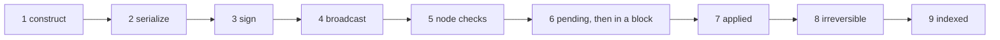

# Transaction Lifecycle

> **Status: Live.** Describes hived 1.30.0 and the public nodes' gateway at commit `4a271e8`. Checked against `api.pixagram.com` on 2026-10-08.

A transaction is a signed list of operations. This page follows one from the program that builds it to the index that serves it back: nine stages, and at each one the checks the chain applies and the error a program sees when a check fails. It is written for developers who sign transactions themselves or debug a library that does; [Developer Quickstart](../09-developers/developer-quickstart.md) shows the same path with a library doing the work. What each operation requires is on [Operations Reference](operations-reference.md); what the chain stores is on [Data Model](data-model.md).

## The nine stages



| Stage | Who | Can still fail? |
|---|---|---|
| 1-3 | Your program, offline | Only your own mistakes |
| 4-5 | The public node you send to | Yes: every rule below, as an error in the JSON-RPC reply |
| 6 | The next witness, and every node re-applying pending transactions | Yes, silently: a transaction accepted at stage 5 can still be left out |
| 7-8 | Every node | A block can be replaced until it is irreversible |
| 9 | Indexers | No, but each index lags by a different amount |

## 1. Construction

A transaction has five fields:

| Field | Value | Rule |
|---|---|---|
| `ref_block_num` | the low 16 bits of a recent block's number | The block must be one of the last 65,536 ([TaPoS](#tapos-and-expiration)) |
| `ref_block_prefix` | bytes 4 to 7 of that block's id, read as a little-endian 32-bit integer | Must match the block the chain has at that number |
| `expiration` | a UTC time, `YYYY-MM-DDTHH:MM:SS` | After the head block's time; at most 24 hours ahead |
| `operations` | one or more operations, applied in order | Every operation must pass its own `validate()` ([Operations Reference](operations-reference.md)) |
| `extensions` | `[]` | Must be empty |

Programs read the head block from `condenser_api.get_dynamic_global_properties` (`head_block_number`, `head_block_id`, `time`) and build the first three fields from it. dpixa sets the expiration 60 seconds after the head block's time ([`broadcast.ts:317-335`][dpixa-broadcast]). A transaction whose expiration is far ahead is still only valid for one hour from the moment the node first sees it, because the node applies an effective expiry of the earlier of the two ([`database.cpp:2602-2622`][db-exp]).

**Size.** The serialized transaction must fit in `maximum_block_size - 256` bytes: 2,096,896 bytes at the live block size of 2,097,152 ([`database.cpp:577-583`][db-size]). An artwork post of several hundred kilobytes fits; the public nodes' gateway, not the chain, is what limits a single HTTP request to about 1 MiB ([stage 4](#4-broadcast)).

**Operations in one transaction.** Operations are applied in order and the whole transaction succeeds or fails together. Since Hive's hardfork 28, which Pixa carries from block 1, one transaction may combine operations that need the posting authority with ones that need the active authority ([stage 3](#3-signing)).

## 2. Serialization

The chain signs and hashes bytes, not JSON. The bytes are the transaction's fields packed in order, little-endian, with variable-length integers for lengths and each operation preceded by its id, the index in the operation list ([Operations Reference](operations-reference.md#the-50-operations)).

There are two encodings, and a signature is valid for exactly one of them:

| Encoding | Assets are written as | Operations in JSON look like | Who uses it |
|---|---|---|---|
| **Legacy** | the symbol as text: `PIXA`, `PXS`, `VESTS` | `["vote", {"voter": …}]` | dpixa, the app, `cli_wallet`, most Hive libraries |
| **HF26** | the numeric asset identifier (NAI), such as `@@000000021` | `{"type": "vote_operation", "value": {"voter": …}}` | Hive's newer libraries |

The legacy encoding is where Pixa and Hive part: a library that writes `HIVE` or `HBD` into the bytes produces a signature the Pixa chain rejects ([Differences from Hive](../09-developers/differences-from-hive.md#identity-and-assets)). The HF26 encoding carries no symbol text, so a library using it needs only the chain id and the `PIX` key prefix.

Two hashes come from the serialized bytes:

- **The transaction id** is the first 20 bytes of the SHA-256 of the transaction *without* its signatures ([`transaction.cpp:21-64`][tx-digest]). It is what `get_transaction` and the account history key on, and it is the same for both encodings only when the two produce the same bytes, which for amounts they do not.
- **The signing digest** is the SHA-256 of the chain id followed by the same bytes ([`transaction.cpp:29-35`][tx-digest]). The chain id, `706978616772616d` followed by 48 zeros, is in every signature, so a transaction signed for Pixa cannot be replayed on Hive or on any test chain.

## 3. Signing

Each signature is a 65-byte recoverable secp256k1 signature of the signing digest, in canonical form ([`crypto.ts:191-200`][dpixa-canonical]). The node recovers the public key from the signature and checks it against the authorities the transaction's operations require.

**Which key.** Every operation names the authority level it needs: posting (votes, posts, `custom_json` with posting auths, profile metadata), active (anything that moves tokens, witness and proposal votes, key changes below owner) or owner (changing the owner key, account recovery). [Operations Reference](operations-reference.md) lists the level for each. The rules the node applies ([`transaction_util.cpp:60-135`][tx-auth]):

- **Strict levels.** An operation that needs the posting authority must be signed by a key *in* the posting authority. Signing a vote with the active key fails with `Missing Posting Authority <account>`. Before Hive's hardfork 28 a higher key stood in for a lower one; Pixa has never had that behaviour.
- **Thresholds.** An authority is a weight threshold and a list of keys and accounts with weights. The signatures present must reach the threshold. Account authorities are followed at most 2 levels deep, across at most 125 accounts.
- **Extra signatures are allowed.** A signature that no operation needs is ignored, not rejected.
- **At most 1,000 signatures** per transaction, checked before any key is recovered, on the API path ([`chain_plugin.cpp:2095-2102`][cp-sig]) and on the P2P path ([`core_messages.cpp:189-195`][net-sig]), and again when the transaction is pushed ([`database.cpp:585-595`][db-sig]). The limit is enforced where the node receives a transaction, not in block validation, and it is new in 1.30.0.

| Failure | Error text |
|---|---|
| Wrong key, or wrong encoding so that the recovered key is not the signer's | `missing required posting authority: Missing Posting Authority <account>` (or `Active`, `Owner`) |
| Signatures valid for neither encoding | `Transaction failed to validate using both new (hf26) and legacy serialization` ([`chain_plugin.cpp:2092-2124`][cp-enc]) |
| More than 1,000 signatures | `Too many signatures - count = <n>, limit 1000` |

## 4. Broadcast

The signed transaction travels as JSON in a JSON-RPC call over HTTPS to a public node:

```json
{"jsonrpc":"2.0","method":"condenser_api.broadcast_transaction","params":[{ "ref_block_num": 2770, "ref_block_prefix": 2254617426, "expiration": "2026-10-08T12:00:00", "operations": [["vote", {"voter": "alice", "author": "bob", "permlink": "horus-portrait-1790597187843", "weight": 10000}]], "extensions": [], "signatures": ["20…"] }],"id":1}
```

| Method | What it returns |
|---|---|
| `condenser_api.broadcast_transaction` | `{}` once the node has accepted the transaction into its pending list. It says nothing about inclusion in a block. |
| `condenser_api.broadcast_transaction_synchronous` | The block number and position once the transaction is in a block, or an error. The public nodes answer it, but their gateway cuts any request at 30 seconds, so a transaction that waits longer returns HTTP 504 while still being processed. |
| `network_broadcast_api.broadcast_transaction` | The same as the first, in the HF26 JSON form. |

**What the gateway does on the way in** ([Chain Architecture](../09-developers/chain-architecture.md#how-a-write-travels), [`nginx.conf:160-200`][nginx]):

- It rejects a request body above about 1 MiB with HTTP 413. A transaction larger than that must go to a node without the gateway, such as your own ([Run an API Node](../10-node-operators/run-an-api-node.md)).
- For a request that fits its buffer, about 10 KiB, it renames 19 Pixa field names to Hive's inside the body, including inside signed text, which is a known defect ([Differences from Hive](../09-developers/differences-from-hive.md#known-issue-renames-inside-text)). A larger request is passed through untouched.
- It routes by the method name. Broadcast methods go to hived.

**What hived does on arrival.** It parses the JSON, accepting either operation form, packs the transaction in the HF26 encoding and verifies the signatures; if that fails, it packs it in the legacy encoding and tries again ([`chain_plugin.cpp:2092-2124`][cp-enc]). Then it runs the checks of stage 5.

## 5. The node's checks

The node applies the transaction to a private copy of its state, in this order. The first failure is returned as the JSON-RPC error; nothing is kept.

| # | Check | Rule | Error contains |
|---|---|---|---|
| 1 | Size | ≤ `maximum_block_size - 256` bytes | `Transaction too large` |
| 2 | Signature count | ≤ 1,000 | `Too many signatures` |
| 3 | Not a duplicate | The id is not in a block or in the pending list | `Duplicate transaction check failed` |
| 4 | Custom-operation rate | At most 5 `custom`, `custom_json` or `custom_binary` operations touching one account in the pending list at a time ([`database.cpp:602-652`][db-custom]) | `already submitted 5 custom json operation(s) this block` |
| 5 | Expiration | `expiration` after the head block's time and at most 24 hours ahead ([TaPoS and expiration](#tapos-and-expiration)) | `transaction_expiration_exception` |
| 6 | TaPoS | `ref_block_prefix` matches the block at `ref_block_num` | `transaction_tapos_exception` |
| 7 | Operation validity | Each operation's `validate()`: field formats, limits, symbols | The operation's own message, such as `Title size limit exceeded.` |
| 8 | Authority | Stage 3's rules | `Missing Posting Authority …` |
| 9 | State rules | Each operation's evaluator: balances, intervals, existence of accounts and posts | The evaluator's message, such as `You may only post once every 5 minutes.` |
| 10 | Resource Credits | The paying account holds the credits the transaction costs ([Resource Credits](../04-tokens-and-economy/resource-credits.md)) | `Account: <name> has <n> RC, needs <m> RC. Please wait to transact or power up HIVE.` |

Resource Credits are the one check that is not part of consensus. A node enforces it on transactions it receives from clients; a transaction that reaches a witness by another route and is put in a block is valid even if the payer lacked credits ([`rc_utility.cpp:539-575`][rc]). The error text still says `HIVE`: hived's messages are Hive's.

### TaPoS and expiration

Transactions as proof of stake (TaPoS) ties a transaction to a block it has seen. `ref_block_num` holds the low 16 bits of that block's number and `ref_block_prefix` 4 bytes of its id, and the node looks the number up in a ring of the last 65,536 blocks, about 54 hours ([`database.cpp:2627-2639`][db-tapos]). Two consequences:

- A transaction built against a block that is later replaced in a fork fails the check on the winning fork and is dropped, which is the point: it cannot be replayed on a chain the signer did not see.
- `ref_block_num` is 16 bits, so a transaction built against a block more than 65,536 blocks old matches a different block and fails. Build against a recent block, which `get_dynamic_global_properties` gives.

Expiration is checked as `now < expiration` with the node's effective expiry: the earlier of the transaction's own expiration and one hour after the node first validated it ([`database.cpp:2602-2622`][db-exp]). A transaction may state an expiration up to 24 hours ahead, but the node drops it from its pending list after one hour at most.

## 6. Pending, then in a block

An accepted transaction sits in the node's pending list and is sent to its peers over P2P. The next witness to produce a block takes pending transactions in order until the block is full and produces the block, normally within 3 seconds. Between blocks, every node re-applies its pending transactions on top of each new block.

Three things can happen to an accepted transaction before it reaches a block, none of which produces an error for the sender:

| What | Why | How you see it |
|---|---|---|
| It is included | The usual case | It appears in a block; `database_api.is_known_transaction` returns `true` from the moment the node has it |
| It is dropped | Re-application failed because the state changed: the post was deleted, the balance was spent by another transaction, the vote became identical to an existing one | It never appears; `is_known_transaction` turns `false` once it expires |
| It waits | The payer ran short of Resource Credits after acceptance: the node keeps retrying it until it expires ([`rc_utility.cpp:562-575`][rc]) | It appears late, or not at all |

`broadcast_transaction` returning `{}` therefore means "accepted", not "done". A program that needs to know polls `condenser_api.get_transaction` with the id, or, within the gateway's 30-second limit, uses `broadcast_transaction_synchronous`.

## 7. Applied in a block

Every node validates the block and applies its transactions in order, running the same checks as stage 5 except the Resource Credit check. The operations' effects become the node's state: the vote's rshares, the transfer's balances, the post's place in its thread and its reward figures until payout. The post's text itself is never in the state; it stays in the block log, where indexers read it ([Data Model](data-model.md)).

The chain also writes **virtual operations** into the block's record: the rshares a vote produced (`effective_comment_vote`), a block's producer reward (`producer_reward`), a payout's parts (`author_reward`, `curation_reward`, `comment_reward`), a conversion filled, a power-down instalment paid ([Operations Reference](operations-reference.md#virtual-operations)). Nobody signs them; they are the chain's own account of what a rule did, and `account_history_api` returns them alongside the signed operations.

## 8. Irreversible

A block is **reversible** until enough of the scheduled witnesses have built on it, then **irreversible**. While reversible it can be replaced by a competing block from another witness, and a transaction in it then goes back to pending and is re-applied, or dropped if it no longer passes. `condenser_api.get_dynamic_global_properties` reports both `head_block_number` and `last_irreversible_block_num`; the difference is how many blocks are still open. A program that pays out or ships something on the strength of a transaction waits until the block that holds it is at or below `last_irreversible_block_num`.

The API reflects this split:

| Call | Sees pending | Sees reversible blocks | Sees irreversible blocks |
|---|---|---|---|
| State reads: `get_accounts`, `get_content`, balances | Yes, on the node that holds them | Yes | Yes |
| `database_api.is_known_transaction` | Yes | Yes | Yes, until the transaction's own `expiration` has passed; after that, `false` ([`database.cpp:339-346`](https://github.com/pixagram-blockchain/pixagram/blob/746118eb3b87dcca768b72fa262ad2aa63e1f177/libraries/chain/database.cpp#L339-L346), [`3228-3236`](https://github.com/pixagram-blockchain/pixagram/blob/746118eb3b87dcca768b72fa262ad2aa63e1f177/libraries/chain/database.cpp#L3228-L3236)) |
| `condenser_api.get_transaction`, `account_history_api.get_account_history`, `get_ops_in_block` | No | No | Yes; for a transaction not yet irreversible the first returns `Unknown Transaction <id>` ([`account_history_api.cpp:211`][ah]) |
| `block_api.get_block` | No | Yes | Yes |

A read of an account's balance can therefore show a transfer that `get_transaction` does not yet know.

## 9. Indexed

| Index | What it indexes | When | Served through |
|---|---|---|---|
| **Account history** (`account_history_rocksdb` plugin on API nodes) | Every operation and virtual operation, by account and by transaction id | On irreversibility | `account_history_api`, `condenser_api.get_account_history`, `get_transaction`, `get_ops_in_block` |
| **HAF** (a second hived writing into PostgreSQL) | Every block, operation and account | As blocks arrive; reversible blocks are kept in a separate set and promoted or discarded | Not directly |
| **Hivemind** (reads HAF) | Posts, votes, follows, reblogs, communities, notifications: the social view | After HAF, as a forking application: it follows a replaced block back | `bridge.*`, `follow_api.*`, `tags_api.*`, 23 `condenser_api` calls |

Two details matter for programs. Hivemind reads `custom_json` operations it understands, such as `follow` and `community`, and ignores the rest, so a follow is a chain fact the moment it is in a block but a feed fact only once Hivemind has processed that block, usually a few seconds later. And Hivemind keeps notifications for 90 days; older interactions remain in the account history but leave `bridge.account_notifications` ([Notifications](../14-product/notifications.md)).

## Reading a transaction back

```bash
rpc() { curl -s -X POST https://api.pixagram.com -H 'Content-Type: application/json' \
  -d "{\"jsonrpc\":\"2.0\",\"method\":\"$1\",\"params\":$2,\"id\":1}"; }

rpc condenser_api.get_dynamic_global_properties '[]'            # head and last irreversible block
rpc database_api.is_known_transaction '{"id":"<txid>"}'         # pending or recent: true / false
rpc condenser_api.get_transaction '["<txid>"]'                  # irreversible only; else "Unknown Transaction"
rpc condenser_api.get_ops_in_block '[949330, true]'             # only_virtual=true: the chain's own operations in a block
```

## Compared with Hive

| | Hive | Pixa |
|---|---|---|
| Transaction size | hived enforces `maximum_block_size - 256`; the voted block size is 64 KiB | the same rule; the voted block size is 2 MiB, so about 2,096,896 bytes |
| Signatures per transaction | bounded only by the size, about 1,000 | 1,000, checked before key recovery (1.30.0) |
| Chain id | `beeab0de…` | `706978616772616d…` |
| Encodings | legacy and HF26 | the same, with `PIXA`, `PXS` as the legacy symbols |
| Gateway | Jussi (Python) in front of hived and Hivemind | an OpenResty configuration that also renames fields; 1 MiB body limit |

## Sources

- **Code** at tag [`v1.30.0`](https://github.com/pixagram-blockchain/pixagram/tree/746118eb3b87dcca768b72fa262ad2aa63e1f177): [`database.cpp:577-595`][db-size] (size and signature count), [`database.cpp:602-652`][db-custom] (custom-operation rate, duplicates), [`database.cpp:2596-2639`][db-exp] (expiration, TaPoS), [`database.cpp:2681-2683`](https://github.com/pixagram-blockchain/pixagram/blob/746118eb3b87dcca768b72fa262ad2aa63e1f177/libraries/chain/database.cpp#L2681-L2683) (authority verification with the hardfork-28 rules), [`transaction.cpp:13-64`][tx-digest] (digests and id), [`transaction_util.cpp:60-135`][tx-auth] and [`transaction_util.cpp:222-256`](https://github.com/pixagram-blockchain/pixagram/blob/746118eb3b87dcca768b72fa262ad2aa63e1f177/libraries/protocol/transaction_util.cpp#L222-L256) (authority rules and errors), [`chain_plugin.cpp:2092-2124`][cp-enc] (encoding retry), [`rc_utility.cpp:539-575`][rc] (Resource Credit enforcement), [`account_history_api.cpp:211`][ah]. Constants: [`config.hpp:235-236`](https://github.com/pixagram-blockchain/pixagram/blob/746118eb3b87dcca768b72fa262ad2aa63e1f177/libraries/protocol/include/hive/protocol/config.hpp#L235-L236) (expiration limits), [`config.hpp:282`](https://github.com/pixagram-blockchain/pixagram/blob/746118eb3b87dcca768b72fa262ad2aa63e1f177/libraries/protocol/include/hive/protocol/config.hpp#L282) (signature limit), [`config.hpp:415-416`](https://github.com/pixagram-blockchain/pixagram/blob/746118eb3b87dcca768b72fa262ad2aa63e1f177/libraries/protocol/include/hive/protocol/config.hpp#L415-L416) (authority depth), [`config.hpp:536`](https://github.com/pixagram-blockchain/pixagram/blob/746118eb3b87dcca768b72fa262ad2aa63e1f177/libraries/protocol/include/hive/protocol/config.hpp#L536) (custom operations per block).
- **dpixa** at commit [`fddb47d`](https://github.com/pixagram-blockchain/dpixa/tree/fddb47d677bf6b2364c1a7bcaba704208432071c): [`broadcast.ts:317-335`][dpixa-broadcast] (reference block and expiration), [`crypto.ts:511-550`](https://github.com/pixagram-blockchain/dpixa/blob/fddb47d677bf6b2364c1a7bcaba704208432071c/src/crypto.ts#L511-L550) (digest and signing), [`crypto.ts:191-200`][dpixa-canonical].
- **Gateway:** [`jussi/nginx.conf:160-200`][nginx] at commit `4a271e8`; the 1 MiB body limit is nginx's default, confirmed with HTTP 413 on all six public nodes on 2026-10-05.
- **Live chain**, 2026-10-08: `maximum_block_size` 2,097,152 from `condenser_api.get_dynamic_global_properties`; `get_transaction` on a transaction in a reversible block returned `Unknown Transaction`.
- [Hive developer portal](https://developers.hive.io/): "Transaction Status" and "Understanding Transaction Status".

[dpixa-broadcast]: https://github.com/pixagram-blockchain/dpixa/blob/fddb47d677bf6b2364c1a7bcaba704208432071c/src/helpers/broadcast.ts#L317-L335
[dpixa-canonical]: https://github.com/pixagram-blockchain/dpixa/blob/fddb47d677bf6b2364c1a7bcaba704208432071c/src/crypto.ts#L191-L200
[db-exp]: https://github.com/pixagram-blockchain/pixagram/blob/746118eb3b87dcca768b72fa262ad2aa63e1f177/libraries/chain/database.cpp#L2596-L2622
[db-size]: https://github.com/pixagram-blockchain/pixagram/blob/746118eb3b87dcca768b72fa262ad2aa63e1f177/libraries/chain/database.cpp#L577-L583
[db-sig]: https://github.com/pixagram-blockchain/pixagram/blob/746118eb3b87dcca768b72fa262ad2aa63e1f177/libraries/chain/database.cpp#L585-L595
[db-custom]: https://github.com/pixagram-blockchain/pixagram/blob/746118eb3b87dcca768b72fa262ad2aa63e1f177/libraries/chain/database.cpp#L602-L652
[cp-sig]: https://github.com/pixagram-blockchain/pixagram/blob/746118eb3b87dcca768b72fa262ad2aa63e1f177/libraries/plugins/chain/chain_plugin.cpp#L2095-L2102
[net-sig]: https://github.com/pixagram-blockchain/pixagram/blob/746118eb3b87dcca768b72fa262ad2aa63e1f177/libraries/net/core_messages.cpp#L189-L195
[db-tapos]: https://github.com/pixagram-blockchain/pixagram/blob/746118eb3b87dcca768b72fa262ad2aa63e1f177/libraries/chain/database.cpp#L2627-L2639
[tx-digest]: https://github.com/pixagram-blockchain/pixagram/blob/746118eb3b87dcca768b72fa262ad2aa63e1f177/libraries/protocol/transaction.cpp#L13-L64
[tx-auth]: https://github.com/pixagram-blockchain/pixagram/blob/746118eb3b87dcca768b72fa262ad2aa63e1f177/libraries/protocol/transaction_util.cpp#L60-L135
[cp-enc]: https://github.com/pixagram-blockchain/pixagram/blob/746118eb3b87dcca768b72fa262ad2aa63e1f177/libraries/plugins/chain/chain_plugin.cpp#L2092-L2124
[rc]: https://github.com/pixagram-blockchain/pixagram/blob/746118eb3b87dcca768b72fa262ad2aa63e1f177/libraries/chain/rc/rc_utility.cpp#L539-L575
[ah]: https://github.com/pixagram-blockchain/pixagram/blob/746118eb3b87dcca768b72fa262ad2aa63e1f177/libraries/plugins/apis/account_history_api/account_history_api.cpp#L211
[nginx]: https://github.com/pixagram-blockchain/pixagram-node/blob/4a271e879818b194ffbef57b8efc5744151017c4/jussi/nginx.conf#L160-L200
