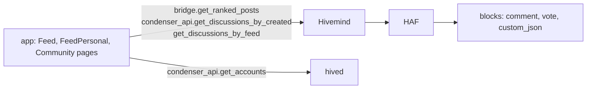

# Feed and Discovery

> **Status: Live.** Described from the app's code of 2026-10-04 (commit `ca1d157`), Hivemind at commit `5765e21` and the public nodes on 2026-10-08. One tab, *Promoted*, is always empty today.

The home page of pixagram.com is a wall of artworks in one of four orders, with a personal feed for people who follow others and a page for each community. This page says where each list comes from, how it is ranked, how far back it goes, and what never appears in it. For each behaviour it says whether the rule is the chain's, the indexer's or the app's, because the answer decides who can change it.

## Where the lists come from



No list is a chain fact. The chain holds posts, votes and `custom_json` operations; Hivemind reads them and keeps scores, follow tables and community membership; the app asks Hivemind for 20 posts at a time and filters them again on the device ([Data Model](../11-protocol-reference/data-model.md#derived-haf-and-hivemind)).

## The four sorts

The home page has four tabs. On a phone they are icons; on a computer each has its label.

| Tab (English) | Address | Hivemind sort | What it orders by | Layer |
|---|---|---|---|---|
| **Newer** | `/created`, the default | `created` via `condenser_api.get_discussions_by_created`, falling back to `bridge.get_ranked_posts` | Creation time, newest first | Indexer |
| **Hottest** | `/hot` | `hot` | Hivemind's hot score ([below](#how-hot-and-trending-are-ranked)) | Indexer |
| **Trending** | `/trending` | `trending` | Hivemind's trending score | Indexer |
| **Promoted** | `/promoted` | `promoted` | **Nothing.** This Hivemind has no `promoted` sort; the call fails and the app shows an empty wall. The first-visit tour still says the tab shows "boosted posts". | App defect |

A tag narrows any sort: `/trending/pixelart` asks for `tag: "pixelart"`. Hivemind matches the post's tags from `json_metadata` and its category ([`Feed.js:167-168, 469-528`][feed-src]).

The app does not expose Hivemind's other sorts, `payout`, `payout_comments` and `muted`, and nothing on Pixa pays to promote a post: Steem's promotion by burning SBD was dropped by Hive before Pixa forked it ([From STEEM to HIVE to PIXA](../01-start-here/from-steem-to-hive-to-pixa.md)).

## How hot and trending are ranked

Hivemind gives every root post two scores when it is created or voted on, and the Hottest and Trending tabs sort by them ([`hot_and_trends.sql:44-126`][hot-src]):

```
rshares part = sign(r) × log10( max( |r| / 10,000,000, 1 ) )      r = the post's net rshares
hot      = rshares part + seconds since 1970 of the post's creation / 10,000
trending = rshares part + seconds since 1970 of the post's creation / 240,000
```

What follows from the formula:

- **Votes count logarithmically, time linearly.** Ten times the rshares add 1 to the score; in *hot*, 10,000 seconds of age (2.8 hours) also add 1, so a post two days newer outranks one with 100 times its votes. In *trending*, 1 point is 240,000 seconds (2.8 days), so votes matter more and a post stays near the top for about a week.
- **A post leaves both lists when it pays out**, 7 days after publication: Hivemind sets its scores to zero then. Comments never have a score.
- **A vote is worth its rshares, so the chain's rules decide the input**: stake, voting mana, and since hardfork 30 the 50,000-rshares dust threshold ([Voting and Curation](../02-social-layer/voting-and-curation.md)). Hivemind only orders.
- **Hivemind scales old votes.** For votes in blocks before 905,693 it multiplies the chain's rshares by one million, an inherited rule from Steem's early chain; for later votes it keeps the chain's value ([Differences from Hive](../09-developers/differences-from-hive.md#hivemind)). The chain crossed that block on 2026-10-05, so until the posts voted before then pay out, around 2026-10-12, Trending is dominated by them: a vote before the boundary counts a million times a vote after it. This is an indexer artefact, not a rule, and it ends by itself.

The scores are not shown to users and no API returns them directly; `bridge.get_ranked_posts` returns the posts in score order.

## The personal feed

The *Feed* page (`/feed`) is for a logged-in account. It asks Hivemind for `condenser_api.get_discussions_by_feed` with the account's name, falling back to `bridge.get_account_posts` with `sort: "feed"`; a visitor who is not logged in sees Trending instead ([`FeedPersonal.js:396-432`][personal-src]).

Hivemind builds a feed from its `hive_feed_cache`: the root posts of every account the reader follows, and the posts those accounts reblogged, from the last month, newest first ([`get_account_posts.sql:211`][feed-cutoff]). Comments are not in it, and nothing is ranked; a follow is the only input.

### Following

A follow is a `custom_json` operation with id `follow`, signed with the posting key, whose payload names the follower, the followed account and a `what` list ([Operations Reference](../11-protocol-reference/operations-reference.md#custom-data)):

| `what` | Hivemind's meaning | In the app |
|---|---|---|
| `["blog"]` | Follow | The follow button on a profile |
| `[]` | Unfollow, or unmute | The same button, pressed again |
| `["ignore"]` | Mute: the account's posts leave your feed and are hidden in lists for you | Not offered; the app writes only `blog` and `[]` |
| `["blacklist"]`, `["follow_blacklist"]`, `["follow_muted"]`, `["reset_…"]` | Hive's blacklist and list-following features | Not offered |

The chain stores the operation and nothing else: no follower count, no feed. Hivemind keeps `hive_follows` and the counts that `bridge.get_profile` and `condenser_api.get_follow_count` return. A follow appears in the feed once Hivemind has processed the block, a few seconds after it is included.

## Communities

A community is a Hivemind construct ([Communities](../02-social-layer/communities.md)): an account named `portal-` followed by five to seven digits, whose first digit is 1, 2 or 3 for the three community types, created by `custom_json` with id `community` ([`community.py:127, 176`][community-regex]). A post belongs to it when its `parent_permlink`, the category, is the community's name.

The community page (`/<portal-name>`) has four tabs: `created`, `hot`, `trending` and `votes`. The first three are Hivemind's sorts for that community; the fourth asks `bridge.get_ranked_posts` for a `votes` sort that Hivemind does not have, so **the fourth tab is always empty** ([`Community.js:428`][community-src]). The page also loads one page of 20 posts and has no way to load more.

Moderation shows in the lists through Hivemind's `stats` on each post:

| What a moderator did | Hivemind | What the app shows |
|---|---|---|
| Muted a post (`mutePost`) | `stats.gray: true`; the post is still returned | The card dimmed and in grey, until pointed at. The confirmation dialog says the post will be hidden; it is dimmed, not hidden ([`PaperCardBlog.js:70`][gray-src]). |
| A member without the role posted in a Journal or Council community | the post is muted by type | The same |
| Hive's `stats.hide` | Never set by this Hivemind | Would dim the card as well |

Muting does not touch the chain or the author's profile; the post stays readable everywhere else.

## Paging

Every list is fetched 20 posts at a time, Hivemind's maximum for a `bridge` call ([JSON-RPC Surface](../12-api-reference/json-rpc.md#limits)). The home and personal feeds load the next 20 as you scroll, passing the last post as `start_author` and `start_permlink`; the community page does not. The app keeps the last list for each tab and tag in memory, so switching back is instant and refreshes behind the scenes.

## What never appears

The lists leave posts out at three levels. Only the first is the chain's.

| Left out | Decided by | Rule |
|---|---|---|
| A post deleted with `delete_comment` | Chain and indexer | The post is gone from the state; Hivemind marks it deleted. Possible only with no replies and no positive votes ([Operations Reference](../11-protocol-reference/operations-reference.md#content-and-voting)). |
| A post the author deleted in the app | App | The latest edit carries `"deleted": true` in `json_metadata` or the body `deleted`; the app filters it from every list. Hivemind still returns it ([Posting and Rewards](../02-social-layer/posting-and-rewards.md#editing-and-deleting)). |
| An artwork marked NSFW, by the `nsfw` flag or the `nsfw` tag | App, per device | Hidden while the *Don't filter NSFW content* setting is off, which is the default; shown blurred until *Don't blur NSFW content* is also on ([Account Settings](account-settings.md#content)). Hivemind stores the flag only for communities ([`Feed.js:296-304`][nsfw-src]). |
| A post whose image the device cannot decode | App | The masonry measures each image before placing it; a failed decode drops the card ([`ImageMeasurer.js:44, 110`][measurer-src]). |
| Comments | Indexer and app | The ranked sorts and the feed return root posts only. |
| Posts by accounts you muted | Indexer | Hivemind applies the reader's `ignore` list when the app sends an `observer`; **the app never sends one**, so this filter is off on pixagram.com. |
| Posts that declined payout | Nobody | They rank like any other post. |

Nothing hides a post from someone who reads the chain directly ([Censorship Resilience and Moderation](../02-social-layer/censorship-resilience-and-moderation.md)).

## What the chain, the indexer and the app each decide

| Behaviour | Chain | Indexer | App |
|---|---|---|---|
| Which posts and votes exist, and their rshares | yes | | |
| Order of the Newer, Hottest and Trending lists | | yes | |
| Follows, feeds, communities, muting | | yes | |
| Twenty posts per page | | yes, the limit | yes, the page size |
| Four tabs, two of them empty | | | yes |
| NSFW and deleted filtering | | | yes |

## Inherited → changed

| | Hive front ends | Pixagram |
|---|---|---|
| Sorts offered | trending, hot, created, payout, promoted, muted | created, hot, trending; promoted and the community `votes` tab are empty |
| Promotion | a burn of HBD once bought a place in *promoted*; removed | none |
| Results per page | up to 100 | 20 |
| Mute lists | followed through `observer` | not sent |
| Community names | `hive-` and digits | `portal-` and digits |

## Sources

- **App** at commit [`ca1d157`](https://github.com/pixagram-blockchain/pixagram-ui-dev/tree/ca1d15762b52ec08f33c69ca9afa34bb78c0df52): [`Feed.js:167-168, 469-528`][feed-src] (sorts, sources, page size), [`Feed.js:296-304`][nsfw-src] (NSFW), [`FeedPersonal.js:396-432`][personal-src], [`Community.js:428`][community-src], [`PaperCardBlog.js:70`][gray-src], [`ImageMeasurer.js`][measurer-src]; tab labels and the tour text, [`en.js:87, 142-144, 2961`](https://github.com/pixagram-blockchain/pixagram-ui-dev/blob/ca1d15762b52ec08f33c69ca9afa34bb78c0df52/src/js/locales/en.js#L2961).
- **Hivemind** at commit [`5765e21`](https://github.com/pixagram-blockchain/hivemind/tree/5765e2113da3c2c3da3c056d7d795c51e925711a): [`hot_and_trends.sql:44-126`][hot-src]; the rshares scaling, [`massive_sync.sql:373-377`](https://github.com/pixagram-blockchain/hivemind/blob/5765e2113da3c2c3da3c056d7d795c51e925711a/hive/db/sql_scripts/massive_sync.sql#L373-L377); the feed window, [`get_account_posts.sql:211`][feed-cutoff]; the result limit, [`api_limits.sql:6`](https://github.com/pixagram-blockchain/hivemind/blob/5765e2113da3c2c3da3c056d7d795c51e925711a/hive/db/sql_scripts/postgrest/utilities/api_limits.sql#L6); community names, [`community.py:127`][community-regex].
- **Live checks**, 2026-10-08: `bridge.get_ranked_posts` with `sort: "promoted"` and `sort: "votes"` returned errors on `api.pixagram.com`; `limit: 21` was rejected; the block-905,693 boundary was crossed at 2026-10-05 23:36 UTC (`block_api.get_block_header`).

[feed-src]: https://github.com/pixagram-blockchain/pixagram-ui-dev/blob/ca1d15762b52ec08f33c69ca9afa34bb78c0df52/src/js/pages/Feed.js#L469-L528
[nsfw-src]: https://github.com/pixagram-blockchain/pixagram-ui-dev/blob/ca1d15762b52ec08f33c69ca9afa34bb78c0df52/src/js/pages/Feed.js#L296-L304
[personal-src]: https://github.com/pixagram-blockchain/pixagram-ui-dev/blob/ca1d15762b52ec08f33c69ca9afa34bb78c0df52/src/js/pages/FeedPersonal.js#L396-L432
[community-src]: https://github.com/pixagram-blockchain/pixagram-ui-dev/blob/ca1d15762b52ec08f33c69ca9afa34bb78c0df52/src/js/pages/Community.js#L428
[gray-src]: https://github.com/pixagram-blockchain/pixagram-ui-dev/blob/ca1d15762b52ec08f33c69ca9afa34bb78c0df52/src/js/components/PaperCardBlog.js#L70
[measurer-src]: https://github.com/pixagram-blockchain/pixagram-ui-dev/blob/ca1d15762b52ec08f33c69ca9afa34bb78c0df52/src/js/components/ImageMeasurer.js#L44
[hot-src]: https://github.com/pixagram-blockchain/hivemind/blob/5765e2113da3c2c3da3c056d7d795c51e925711a/hive/db/sql_scripts/hot_and_trends.sql#L44-L126
[feed-cutoff]: https://github.com/pixagram-blockchain/hivemind/blob/5765e2113da3c2c3da3c056d7d795c51e925711a/hive/db/sql_scripts/postgrest/utilities/get_account_posts.sql#L211
[community-regex]: https://github.com/pixagram-blockchain/hivemind/blob/5765e2113da3c2c3da3c056d7d795c51e925711a/hive/indexer/community.py#L127
