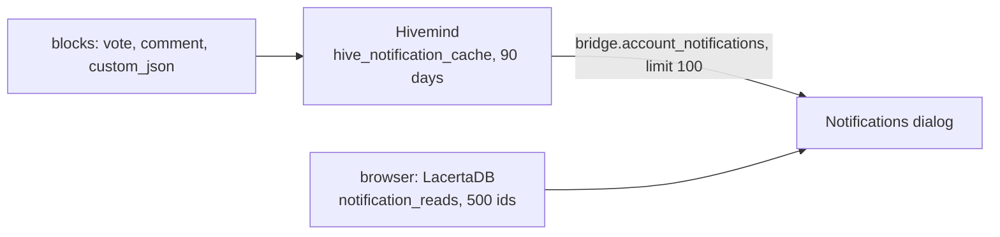

# Notifications

> **Status: Live.** Described from the app's code of 2026-10-04 (commit `ca1d157`) and Hivemind at commit `5765e21`. Checked on `api.pixagram.com` on 2026-10-08.

The bell in the app lists what other people did with your content: votes, replies, mentions, reblogs, follows and community actions. None of this is stored on the chain as a notification. Hivemind computes the list from the operations in the blocks, the app fetches it when you open the dialog, and the app remembers which ones you have read, on the device you read them on. This page says where each part lives, which events become notifications and which do not, and what to expect from the read state.

## Where a notification comes from

| Part | Layer | What it decides |
|---|---|---|
| The events | Chain | A vote, a comment, a `custom_json` follow or reblog, a community action: all signed operations in blocks ([Operations Reference](../11-protocol-reference/operations-reference.md)) |
| Which events are notifications, for whom, with what score | Indexer | Hivemind's notification rules, below |
| How many are shown, and what has been read | App | 100 newest from Hivemind; read ids kept in the browser |

## The types

Hivemind writes one notification per qualifying event, for the account concerned. The app knows these types and renders each with its own wording ([`NotificationsDialog.js:54-70`][types]):

| Type | Event | Who is notified |
|---|---|---|
| `vote` | A vote on your post or comment | The author |
| `reply` | A comment on your post | The author |
| `reply_comment` | A reply to your comment | The comment's author |
| `mention` | `@yourname` in a post or comment | The mentioned account |
| `reblog` | Someone reblogged your post | The author |
| `follow` | Someone followed you | The followed account |
| `new_community` | A community was created | The creator |
| `set_role`, `set_props`, `set_label` | A community changed your role, its settings, or your title | The member, or the community's team |
| `subscribe` | Someone subscribed to a community | The community |
| `pin_post`, `unpin_post`, `mute_post`, `unmute_post`, `flag_post` | Moderation on your post | The author, or the moderators |
| `error` | Hivemind rejected a `custom_json` community operation you signed, with the reason ([Create a Community](../08-guides/create-a-community.md)) | The signer |

Hivemind gives each notification a **score** and `bridge.account_notifications` returns only those at or above `min_score`, which defaults to 25. The app does not pass `min_score`, so the default applies ([`bridge_api_account_notifications.sql:25-31`][minscore]):

- A vote's score comes from its value: below 0.020 PXS it is -1 and the vote is **not listed**; from 0.020 PXS it is 25, from 0.100 PXS 50, and so on to 100 ([`notifications_view.sql:3-15`][votescore]). Since hardfork 30 small accounts' votes count, but most of them still fall under this line.
- Every other type's score is the actor's reputation on Hivemind's 0 to 100 scale. Hivemind's reputation tracker does not run on the public nodes, so every actor scores 25 and every follow, reply, mention or community action is listed ([`massive_sync.sql:2401-2462`][repscore]; [Data Model](../11-protocol-reference/data-model.md#derived-haf-and-hivemind)).

**Not notifications**, because Hivemind does not generate them: transfers and other wallet events, power-ups and power-downs, delegations, proposal votes and payments, witness votes, reward payouts. The wallet's *History* tab is where those appear ([Wallet Basics](../08-guides/wallet-basics.md#history-and-taxes)), read from `condenser_api.get_account_history`.

## What the app does

- **Fetches on demand.** Opening the dialog, logging in or switching account calls `bridge.account_notifications` with `limit: 100` ([`NotificationsDialog.js:596-638`][fetch]). Nothing polls in the background, and there is no badge on the bell until the dialog has loaded; the count in the title, "Notifications (n)", is the number of the 100 not yet marked read.
- **Keeps the read state on the device.** *Mark all as read* stores the ids of the listed notifications in the browser's local database (LacertaDB, collection `notification_reads`), at most 500 per account, newest kept ([`pixaproxyapi.js:4447-4480`][reads]). Another browser, or a cleared browser, starts with everything unread. Hive's `custom_json` `notify` operation, which records the last read time on chain for Hivemind's `unread_notifications`, is not used.
- **Empty state.** "No notifications yet" and "When people interact with your content, you'll see it here".
- **Links.** A notification about a post opens the post; about an account, the profile.

## What to expect

| Situation | Result | Why |
|---|---|---|
| An event older than 90 days | Not listed | Hivemind keeps notifications for 90 days ([`bridge_api_post_notifications.sql:72`][ninety]) |
| More than 100 events since you last looked | Only the newest 100 | The app's limit; Hivemind allows up to 100 per call |
| A vote worth less than 0.020 PXS | Not listed | Its score is below Hivemind's default `min_score` of 25, which the app does not override |
| A vote changed or removed | One notification per vote operation; a removed vote still leaves its notification | Hivemind writes on the operation |
| A reply that was later deleted | Listed, opening a missing post | Hivemind's notification outlives the post |
| Reading on two devices | Each device has its own read state | The read ids are local |
| A `custom_json` with id `notify` from another app | Ignored by this app | It reads no on-chain read marker |

## Inherited → changed

| | Hive front ends | Pixagram |
|---|---|---|
| Source | Hivemind `bridge.account_notifications` | the same |
| Read marker | `custom_json` `notify` `setLastRead`, on chain, shared across apps | in the browser only |
| Transfers as notifications | some front ends add them from the account history | not shown in the bell |
| Retention | 90 days | 90 days |

## Sources

- **App** at commit [`ca1d157`](https://github.com/pixagram-blockchain/pixagram-ui-dev/tree/ca1d15762b52ec08f33c69ca9afa34bb78c0df52): [`NotificationsDialog.js:54-70`][types] (types), [`596-638`][fetch] (fetch and limit), [`pixaproxyapi.js:4428-4480`][reads] (the bridge call and the read store); English text in [`en.js:1553-1556`](https://github.com/pixagram-blockchain/pixagram-ui-dev/blob/ca1d15762b52ec08f33c69ca9afa34bb78c0df52/src/js/locales/en.js#L1553-L1556).
- **Hivemind** at commit [`5765e21`](https://github.com/pixagram-blockchain/hivemind/tree/5765e2113da3c2c3da3c056d7d795c51e925711a): notification types, [`hive/indexer/notify_type.py`](https://github.com/pixagram-blockchain/hivemind/blob/5765e2113da3c2c3da3c056d7d795c51e925711a/hive/indexer/notify_type.py); scores, [`notifications_view.sql:3-15`][votescore] and [`massive_sync.sql:2401-2462`][repscore]; the `min_score` and `limit` defaults, [`bridge_api_account_notifications.sql:25-31`][minscore]; the 90-day window, [`bridge_api_post_notifications.sql:72`][ninety].
- **Live check**, 2026-10-08: `bridge.account_notifications` with `limit: 100` on `api.pixagram.com`.

[types]: https://github.com/pixagram-blockchain/pixagram-ui-dev/blob/ca1d15762b52ec08f33c69ca9afa34bb78c0df52/src/js/components/NotificationsDialog.js#L54-L70
[fetch]: https://github.com/pixagram-blockchain/pixagram-ui-dev/blob/ca1d15762b52ec08f33c69ca9afa34bb78c0df52/src/js/components/NotificationsDialog.js#L596-L638
[reads]: https://github.com/pixagram-blockchain/pixagram-ui-dev/blob/ca1d15762b52ec08f33c69ca9afa34bb78c0df52/src/js/utils/api/pixaproxyapi.js#L4428-L4480
[ninety]: https://github.com/pixagram-blockchain/hivemind/blob/5765e2113da3c2c3da3c056d7d795c51e925711a/hive/db/sql_scripts/postgrest/bridge_api/bridge_api_post_notifications.sql#L72
[minscore]: https://github.com/pixagram-blockchain/hivemind/blob/5765e2113da3c2c3da3c056d7d795c51e925711a/hive/db/sql_scripts/postgrest/bridge_api/bridge_api_account_notifications.sql#L25-L31
[votescore]: https://github.com/pixagram-blockchain/hivemind/blob/5765e2113da3c2c3da3c056d7d795c51e925711a/hive/db/sql_scripts/notifications_view.sql#L3-L15
[repscore]: https://github.com/pixagram-blockchain/hivemind/blob/5765e2113da3c2c3da3c056d7d795c51e925711a/hive/db/sql_scripts/massive_sync.sql#L2401-L2462
