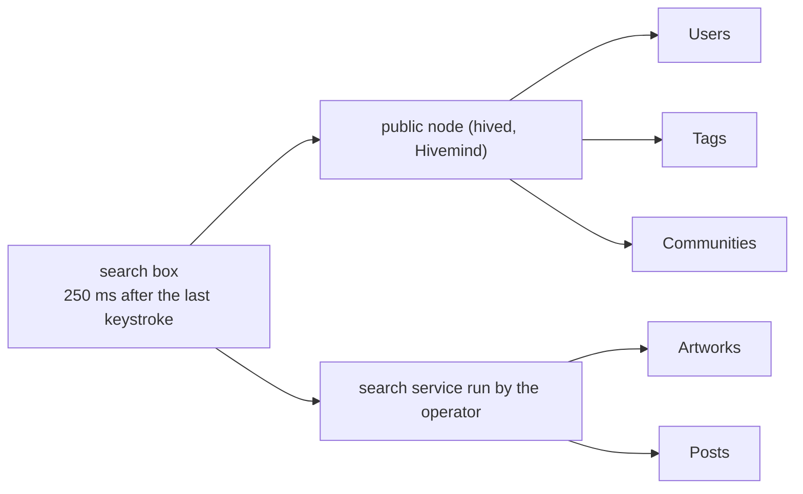

# Search

> **Status: Live.** Described from the app's code of 2026-10-04 (commit `ca1d157`) and the public nodes on 2026-10-08. The artwork and post index is a service run for the app; its code is not published.

The search box at the top of pixagram.com finds users, tags, communities, artworks and posts. The first three come from the chain's own API; the last two come from a separate index the app's operator runs. This page says what each part can find, where the match is made, which filters exist, and what cannot be found yet, so that nobody expects the search to be a view of the whole chain. It is not one.

## Two searches in one box

| Section (English label) | Source | Call | How the match is made | Results |
|---|---|---|---|---|
| **Users** | hived | `condenser_api.lookup_accounts` | Account names that **start with** the text; an account found this way whose name is `portal-` and digits is moved to Communities | up to 16 |
| **Tags** | Hivemind | `condenser_api.get_trending_tags`, 100 tags | The text is matched **inside the names of the 100 trending tags**, in the browser; the typed text itself is always offered as a tag, so `#anything` can be opened | up to 32 |
| **Communities** | Hivemind | `bridge.list_communities` with the text as `query`, plus a client-side match on the 100 top-ranked communities | Hivemind's match on title and about, then the browser's | up to 16 |
| **Artworks** | the search service | `GET /search` with the text | The service's index of each artwork's title, tags, description and a caption it generates; the ranking is the service's | up to 32 |
| **Posts** | the search service | the same request | Full text of blog posts | up to 16 |
| **History** | the browser | — | The tags and users you opened in this session, newest first | 20 kept, 7 shown |

The box waits 250 ms after the last keystroke, then runs the chain calls and the index call together ([`useSearch.js:176-201, 352`][usesearch]; limits in [`config.js:13-27`][config]). Answers are cached in memory for 10 minutes, 50 terms at most. If the service does not answer, the Artworks and Posts sections are empty and the rest still works ([`searchApi.js:124-140`][searchapi]).

The search service is a web service the app calls over HTTPS at an address compiled into the app, which this documentation does not publish. According to the comments in the app's code it keeps a full-text index and an image-embedding index of artworks and posts; its code is not published, so this page describes only what the app sends and receives.

## Filters

The *Filters* panel applies to the Artworks and Posts sections only; the chain-side sections ignore it ([`SearchFilters.js`][filters-ui], [`filters.js:29-60, 150-156`][filters]).

| Filter (label) | Choices | What the service receives |
|---|---|---|
| **Show** | All, Artworks, Posts | `type` |
| **Time** | Any, 24h, Week, Month, Year, Custom (two dates) | `from` and `to` as dates |
| **Color** | 20 swatches, the service's colour buckets, loaded from its `/vocab`; up to 10; mode *Dominant* or *Anywhere* | `color` or `has_color`; artworks only |
| **Authors** | up to 10 account names, with suggestions from `lookup_accounts` | `author` |
| **Communities** | up to 10 communities, with suggestions from `list_communities` | `community` |

With a search text, results come in the service's relevance order; with filters and no text, newest first. NSFW artworks are always excluded: the app sends `nsfw=exclude` on every request and offers no way to change it ([`searchApi.js:208-211`][searchapi-nsfw]). An empty result shows "Nothing matches these filters yet." with filters, or "No result found for …" without.

## The address of a search

An open search is part of the page address, so it can be shared and comes back with the browser's back button: `+search-` followed by a base64url-encoded JSON object with the text (`q`), the filters (`f`) and whether the panel is open (`p`). The text is cut at 256 characters and the whole object at 2,000 ([`constants.js:883-884, 1019`][meta]).

## What cannot be found

| Not searchable today | Why | Where it is |
|---|---|---|
| Comments | Neither the chain's API nor the service indexes comment text | Under the post, through `bridge.get_discussion` |
| Transactions, blocks, operations | Not a search target; the chain's API looks them up by id | `condenser_api.get_transaction`, `block_api.get_block` ([JSON-RPC Surface](../12-api-reference/json-rpc.md)) |
| Account profiles: `about`, `location`, `website` | `lookup_accounts` matches names only | `bridge.get_profile` for one account |
| Tags outside the 100 trending ones | The app matches only that list; any tag can still be opened by typing it | `/trending/<tag>` |
| Artworks marked NSFW | Excluded by the app on every request | Feeds, with the NSFW setting on ([Account Settings](account-settings.md#content)) |
| Posts and artworks the service has not indexed yet | The service indexes on its own schedule; the app does not know how far behind it is | Feeds |
| Anything by visual similarity | The published perceptual hash, PAPH, is not used by the app or the service ([PAPH](../15-search-and-indexing/paph.md)) | — |
| A search API for other programs | The service has no published interface or terms; it may change without notice | The chain's own calls above |

The app bundles `@pixagram/pixahash`, but for a different purpose: hashing an artwork's content when it is stored on the device ([`png-db.js:1`][pngdb]). No perceptual or similarity search runs anywhere in the app.

## What the chain, the indexer, the service and the app each decide

| Behaviour | Chain | Hivemind | Search service | App |
|---|---|---|---|---|
| Account names | yes | | | |
| Trending tags, community list and match | | yes | | the match inside the 100 tags |
| Artwork and post results, ranking, colours, captions | | | yes | |
| NSFW exclusion | | | honours the parameter | sends it, always |
| Limits, debounce, cache, history | | | | yes |

## Inherited → changed

| | Hive front ends | Pixagram |
|---|---|---|
| Search backend | varies by front end; some have none | the operator's service for artworks and posts, the node for the rest |
| Account search | `lookup_accounts`, prefix match | the same |
| Image search | none | by title, tags, description and generated caption; colour filters |
| NSFW in search | per user setting | always excluded |

## Sources

- **App** at commit [`ca1d157`](https://github.com/pixagram-blockchain/pixagram-ui-dev/tree/ca1d15762b52ec08f33c69ca9afa34bb78c0df52): [`components/search/config.js`][config] (limits, debounce, cache, colour buckets), [`useSearch.js`][usesearch] (the chain calls), [`searchApi.js`][searchapi] (the service calls, `nsfw=exclude`, `/vocab`), [`filters.js`][filters] and [`SearchFilters.js`][filters-ui] (filters and labels), [`constants.js:883-1020`][meta] (the `+search-` address), [`Index.js:902-933, 3444`](https://github.com/pixagram-blockchain/pixagram-ui-dev/blob/ca1d15762b52ec08f33c69ca9afa34bb78c0df52/src/js/pages/Index.js#L902-L933) (history), [`png-db.js:1`][pngdb]; English labels in [`en.js:83-92, 219-222, 1274-1276, 2570-2616`](https://github.com/pixagram-blockchain/pixagram-ui-dev/blob/ca1d15762b52ec08f33c69ca9afa34bb78c0df52/src/js/locales/en.js#L2613-L2616).
- **Live checks**, 2026-10-08: `condenser_api.lookup_accounts`, `get_trending_tags` and `bridge.list_communities` on `api.pixagram.com`. The search service was not called; its behaviour is described from the requests the app builds.

[config]: https://github.com/pixagram-blockchain/pixagram-ui-dev/blob/ca1d15762b52ec08f33c69ca9afa34bb78c0df52/src/js/components/search/config.js#L13-L27
[usesearch]: https://github.com/pixagram-blockchain/pixagram-ui-dev/blob/ca1d15762b52ec08f33c69ca9afa34bb78c0df52/src/js/components/search/useSearch.js#L176-L201
[searchapi]: https://github.com/pixagram-blockchain/pixagram-ui-dev/blob/ca1d15762b52ec08f33c69ca9afa34bb78c0df52/src/js/components/search/searchApi.js#L124-L140
[searchapi-nsfw]: https://github.com/pixagram-blockchain/pixagram-ui-dev/blob/ca1d15762b52ec08f33c69ca9afa34bb78c0df52/src/js/components/search/searchApi.js#L208-L211
[filters]: https://github.com/pixagram-blockchain/pixagram-ui-dev/blob/ca1d15762b52ec08f33c69ca9afa34bb78c0df52/src/js/components/search/filters.js#L29-L60
[filters-ui]: https://github.com/pixagram-blockchain/pixagram-ui-dev/blob/ca1d15762b52ec08f33c69ca9afa34bb78c0df52/src/js/components/search/SearchFilters.js#L215-L300
[meta]: https://github.com/pixagram-blockchain/pixagram-ui-dev/blob/ca1d15762b52ec08f33c69ca9afa34bb78c0df52/src/js/utils/constants.js#L883-L884
[pngdb]: https://github.com/pixagram-blockchain/pixagram-ui-dev/blob/ca1d15762b52ec08f33c69ca9afa34bb78c0df52/src/js/utils/png-db.js#L1
