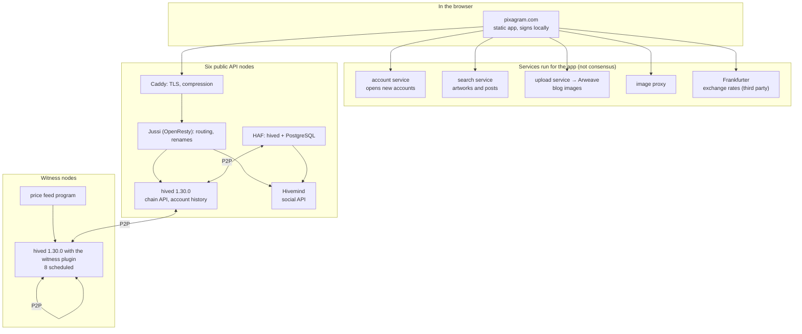

# Architecture

> **Status: Live.** The network as run on 2026-10-08: hived 1.30.0 on the witnesses and the six public API nodes, the `pixagram-node` stack at commit `4a271e8`, the app at commit `ca1d157`. Hostnames of the operator's private services are not published here.

This page draws the whole network from a reader's browser down to the witnesses, names every program in the path and who runs it, and follows the data through them. [Chain Architecture](../09-developers/chain-architecture.md) explains the same parts from a developer's seat; [Run a Node](../10-node-operators/run-a-node.md) and [Run an API Node](../10-node-operators/run-an-api-node.md) say how to run them. This page is about how they are deployed today.

## The stack

Three tiers, with a different kind of trust in each:

| Tier | Programs | Who runs them | If one fails |
|---|---|---|---|
| **Consensus** | The witness nodes: hived with the `witness` plugin and a block-signing key, and each witness's price-feed program | The elected witnesses, each on their own server ([Witnesses and DPoS](../07-governance/witnesses-and-dpos.md)) | The others keep producing; the chain continues while at least one does |
| **Access** | The six public API nodes: Caddy, Jussi, hived, HAF, Hivemind | The operator runs one; five witnesses run one each | Clients switch to another node; every node serves the same chain |
| **Application services** | The static app, the account service, the search service, the upload service and image proxy; Frankfurter, a third party, for currency rates | Pixagram SA and Pixa Rex S.A.; Frankfurter by its own maintainers | Sign-up, search, blog images or currency display stop working; posting, voting and transfers do not, because they need only an API node |

Nothing in the third tier touches consensus. A reader with a hived of their own needs none of it ([Chain Architecture](../09-developers/chain-architecture.md#where-each-kind-of-data-lives)).

## The six public nodes

The app ships this list and, on first start, times all six and keeps the fastest that answers ([Account Settings](../14-product/account-settings.md#endpoint)). The names and regions are the app's ([`constants.js:94-137`][nodes]); the last column is from each witness's registration on chain.

| Address | Name in the app | Region named | Registered by |
|---|---|---|---|
| `https://api.pixagram.com` | Pixagram (Poland) | Warsaw | the operator, Pixa Rex S.A. |
| `https://pixarex.net` | Rex (USA) | Council Bluffs, Iowa | the witness `rex` |
| `https://merlion.surf` | Merlion (Singapore) | Singapore | the witness `merlion` |
| `https://blockforge.lol` | Blockforge (France) | France | the witness `blockforge` |
| `https://boitata.quest` | Boitata (Sao Paulo) | São Paulo | the witness `boitata` |
| `https://pixa-dubai.xyz` | Matus (Dubai) | Dubai | the witness `nodeprime` |

Five of the six addresses are the URLs the witnesses registered on chain (`condenser_api.get_witnesses_by_vote`, 2026-10-08).

All six run the `pixagram-node` stack ([Run an API Node](../10-node-operators/run-an-api-node.md#what-the-stack-runs)) and answered identically on 2026-10-05; on 2026-10-08 `pixarex.net` did not accept a connection from the network used for the check ([JSON-RPC Surface](../12-api-reference/json-rpc.md#endpoints)). Each node is one machine with the whole stack; there is no load balancer in front of the six and no shared database between them. Their hived processes find each other and the witnesses over P2P.

## The witness nodes

A witness runs hived with the `witness` plugin, loads only the plugins block production needs, keeps its signing key in `config.ini`, and runs a price-feed program that publishes the PIXA price of a Big Mac every hour ([Become a Witness](../10-node-operators/become-a-witness.md); pixa.org's [node operator guide](https://pixa.org/witness.html)). On 2026-10-08, 8 witnesses were scheduled, all on 1.30.0 (`condenser_api.get_witness_schedule`, `get_witnesses_by_vote`). The live list with each witness's last block is on the [witness status page](https://pixagram.com/witness-status/), a static page that reads the public API from the browser.

A witness node is not an API node: it answers no public calls, and the five witnesses who also serve the public run a second, separate stack for that.

## How data flows

### A reader opens the home page

1. The browser loads the app, a static site, from pixagram.com.
2. The app picks a public node and calls `bridge.get_ranked_posts` (20 posts), `condenser_api.get_accounts` for the authors and `get_dynamic_global_properties` ([Feed and Discovery](../14-product/feed-and-discovery.md)).
3. Caddy terminates TLS, Jussi routes the social call to Hivemind and the chain calls to hived, and renames fields on the way back ([JSON-RPC Surface](../12-api-reference/json-rpc.md#routing)).
4. Hivemind answers from PostgreSQL, where HAF wrote the blocks and Hivemind's own tables hold the scores; hived answers from its state.
5. Artworks arrive inside the posts, as data URIs; an image inside a blog post is a link, loaded through the image proxy ([Pixel Art On Chain](../03-art-on-chain/pixel-art-on-chain.md#images-that-live-elsewhere)).

### A user publishes an artwork

1. The app builds a `comment` operation with the image in the body and signs it in the browser with the posting key ([Transaction Lifecycle](../11-protocol-reference/transaction-lifecycle.md)).
2. It sends `condenser_api.broadcast_transaction` to the chosen node. Caddy, Jussi, hived; hived checks it and relays it over P2P.
3. The next scheduled witness includes it in a block, within 3 seconds.
4. Every hived, including the API nodes', applies the block. HAF writes it into PostgreSQL; Hivemind indexes it a few seconds later; the account-history plugin stores it once the block is irreversible.
5. The artwork appears in Newer at once from Hivemind, and in Hottest and Trending as it is voted.

### A user signs up

1. The app generates keys in the browser; only the public keys leave it.
2. It sends them to the account service, a program the operator runs, which pays the creation fee, broadcasts `account_create` and delegates a little Pixa Power to the new account ([Create an Account](../08-guides/create-an-account.md)).
3. The account exists once that transaction is in a block; the app logs the user in with the keys it generated.

Sign-up is the one everyday action that depends on a Pixagram-run server. Anyone with PIXA can open an account without it, with `account_create` or an account ticket ([Operations Reference](../11-protocol-reference/operations-reference.md#accounts-and-keys)).

## What is where

| Data | Lives in | Copies |
|---|---|---|
| The chain: every block since genesis | `block_log` of every hived: 8 witnesses, 6 API nodes, 6 HAF instances, and anyone else's node | at least 20 on 2026-10-08 |
| Current state: balances, votes, witnesses | Every hived's `shared_memory.bin`, rebuilt from the blocks | the same |
| Social index: feeds, follows, communities, notifications | Each API node's PostgreSQL | 6, each rebuilt from its HAF |
| Account history | Each API node's RocksDB | 6 |
| Artwork and post search index | The search service | 1, the operator's |
| Blog images | Arweave, a separate permanent-storage network | Arweave's replication |
| The app's code | pixagram.com; source on GitHub | — |
| Keys | The user's browser, encrypted; never a server | — |

## What this architecture does not have

Recorded so that the planned pages of this section start from the facts.

- **No monitoring or alerting shared across operators.** Each operator watches their own node; the witness status page shows missed blocks for everyone to see.
- **No published backup or disaster-recovery procedure** for the API nodes beyond the replay from the block log that the stack supports ([Run a Node](../10-node-operators/run-a-node.md#replay-and-resync)).
- **No load balancing or failover** among the six nodes except what the app does itself.
- **No capacity figures.** No benchmark of the public nodes has been published ([Style Guide](../22-about/style-guide.md#retired-names-and-claims) on the retired "300,000 TPS" claim).
- **No testnet** reachable by the public.

## Compared with Hive

| | Hive | Pixa |
|---|---|---|
| Public API nodes | about 15, run by witnesses and companies, several behind load balancers | 6, one machine each |
| Witness nodes | 20 elected plus a backup slot, with most witnesses running backup nodes | 8 scheduled on 2026-10-08, of up to 21 |
| Social indexer | Hivemind on HAF | the same, one per API node |
| Account creation for newcomers | front ends' own services and faucets | the operator's account service |
| Image hosting | front ends' own services | Arweave through the operator's upload service |

## Sources

- **Deployment code:** [`pixagram-node`](https://github.com/pixagram-blockchain/pixagram-node/tree/4a271e879818b194ffbef57b8efc5744151017c4) at commit `4a271e8` (`docker-compose.yml`, `jussi/nginx.conf`, `ssl-proxy/Caddyfile`); [`witness`](https://github.com/pixagram-blockchain/witness/tree/e3b88414f563e02beff7587a3722d076214652c3) at commit `e3b8841`; [`bigmac-feed`](https://github.com/pixagram-blockchain/bigmac-feed) and [`witness-status`](https://github.com/pixagram-blockchain/witness-status).
- **App** at commit [`ca1d157`](https://github.com/pixagram-blockchain/pixagram-ui-dev/tree/ca1d15762b52ec08f33c69ca9afa34bb78c0df52): the node list, [`constants.js:94-137`][nodes]; the services it calls, through [Search](../14-product/search.md#sources), [Create an Account](../08-guides/create-an-account.md#sources) and [Pixel Art On Chain](../03-art-on-chain/pixel-art-on-chain.md#sources).
- **Live network**, 2026-10-08: `condenser_api.get_witness_schedule` (8 scheduled), `get_witnesses_by_vote` (versions and URLs), `get_dynamic_global_properties` on five of the six nodes; the witness status page.
- **Hive:** [developers.hive.io](https://developers.hive.io/) node lists, read 2026-10-05.

[nodes]: https://github.com/pixagram-blockchain/pixagram-ui-dev/blob/ca1d15762b52ec08f33c69ca9afa34bb78c0df52/src/js/utils/constants.js#L94-L137
